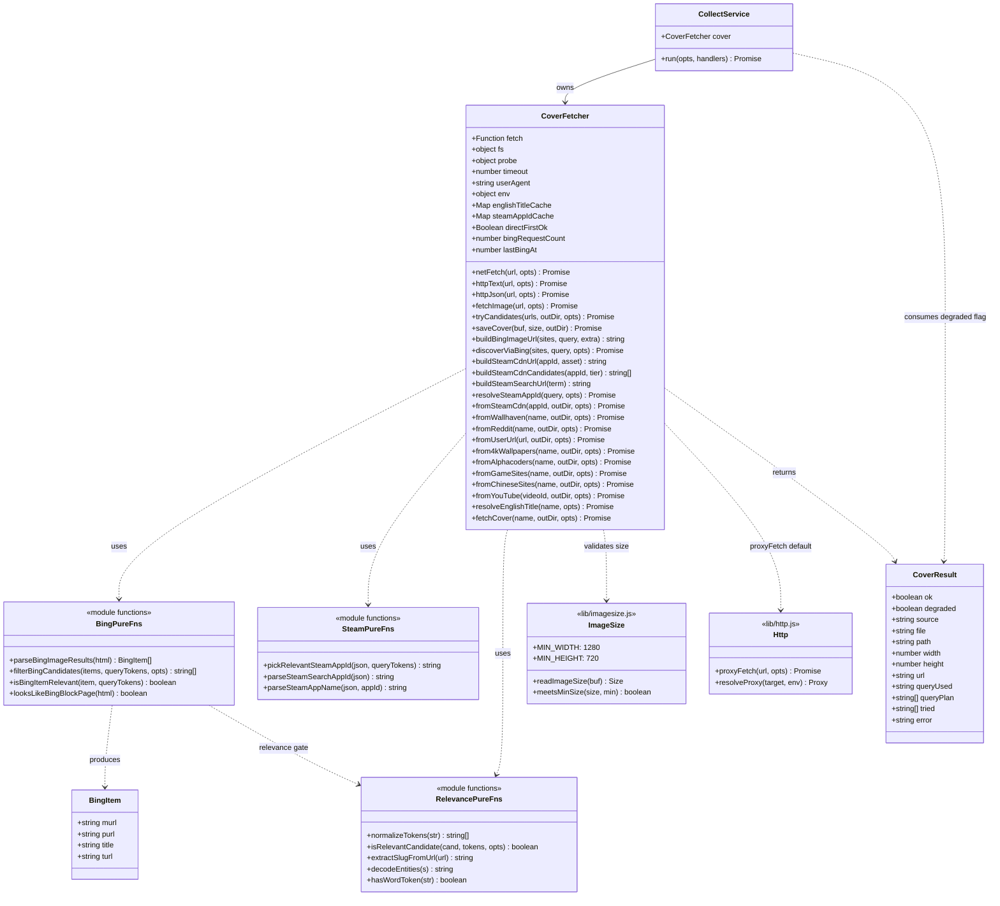
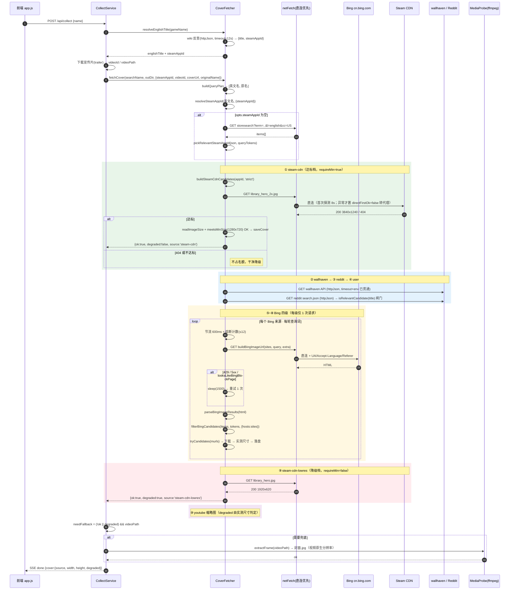
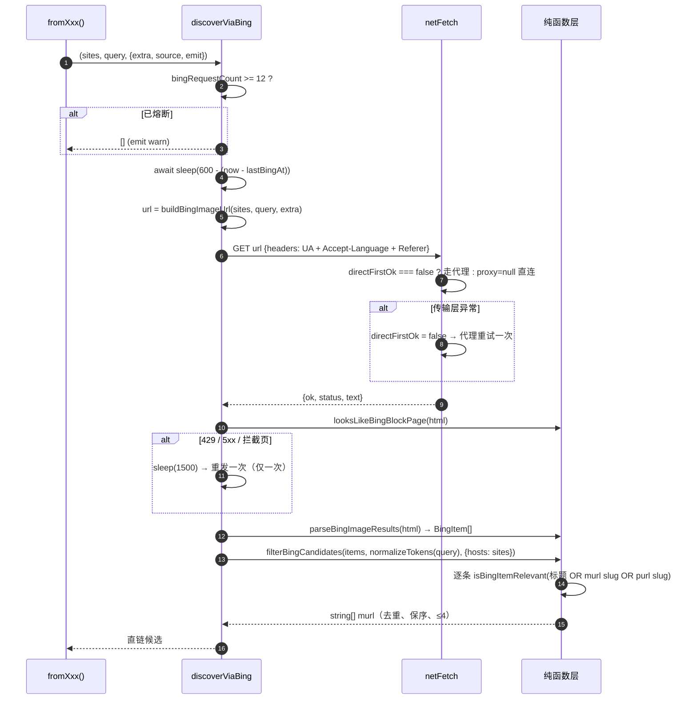
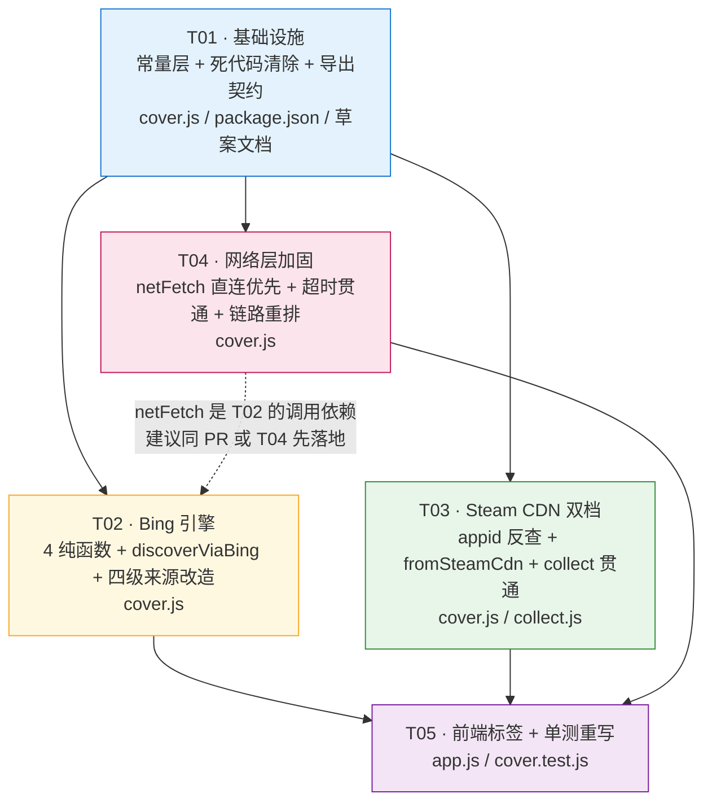

# material-hub 封面来源改造 —— 最终设计 + 任务分解

> **2026-08-14 变更**：Bing 图片搜索不再严格按 `site:` 过滤（实测返回全为无关站点图），
> `4kwallpapers` / `game-sites` / `chinese-sites` 三个 Bing 源已从 `fetchCover` / `collectCandidates`
> 的 order 移除；`alphacoders` 改为站内搜索直抓原图（`discoverAlphacodersDirect`）。
> 本文其余内容为当时定稿记录，实现以 `lib/cover.js` 为准。

> 架构师：高见远（Gao） · 日期：2026-08-04 · 状态：**定稿，可直接交付工程师**
> 上游：`docs/material-hub-cover-sources-redesign.md`（调研草案）
> 基线代码：`material-hub@2.6.7`

---

## 零、读代码后的三个关键更正（草案有误，以本节为准）

改造前必须先纠正草案里的三处事实错误，否则实现会跑偏。

| # | 草案说法 | 真实代码 | 影响 |
|---|---|---|---|
| **C1** | 封面最小尺寸 1920×1080 | `lib/imagesize.js` 里 **`MIN_WIDTH=1280` / `MIN_HEIGHT=720`**。cover.js 顶部注释写的「≥1920×1080」是 v1 遗留的**过期注释** | Steam / YouTube 的达标判定全部要按 1280×720 重算 |
| **C2** | steamAppId「已通过 Wikidata 拿到」 | `collect.js:251` 确实拿到了 `const steamAppId = english.steamAppId \|\| ''`，但**只传给了 trailer**（`downloadFromSteam`），**从未传给 `fetchCover`** | 必须在 `collect.js:362` 的 `fetchCover(...)` opts 里补 `steamAppId` |
| **C3** | 超时问题只出在 DuckDuckGo | **`lookupEnglishTitleFromWiki` 与 `fromReddit` 用裸 `this.fetch(url, {headers, signal})` 调用，没传 `timeout` 也没传 `env`**。而 `lib/http.js` 的 `proxyFetch` **完全忽略 `signal`**，只认 `opts.timeout` → 这些请求实际用的是 `DEFAULT_TIMEOUT = 120s` | 维基链路 4 个串行请求最坏 **8 分钟**才进入封面主链。这是「全超时」的第二个根因，必须一并修 |

> **C1 的连带结论**：`library_hero.jpg` 1920×620 卡在 **高 620 < 720**（只差 100px），`library_600x900_2x.jpg` 1200×1800 卡在 **宽 1200 < 1280**（只差 80px）。而 `library_hero_2x.jpg`（3840×1240）与 `page_bg_generated_v6b.jpg`（1438×810）**双双达标**。Steam 来源因此从「必然降级」变成「有真正的达标档」。

**其它已确认事实**：

- 测试栈 = Node 内置 `node:test` + `node:assert/strict`，`npm test` = `node --test`，**零第三方依赖**（package.json 只有 express/dotenv/ffmpeg-installer）。
- `lib/http.js` 的 `requestOnce` 支持 `opts.proxy !== undefined ? opts.proxy : resolveProxy(...)` —— **显式传 `proxy: null` 即可强制直连**，且这个字段能从 `proxyFetch(url, opts)` 一路透传下来。这是 Bing 直连策略的实现基础，不需要改 http.js。
- `extractWebEnglishCandidates` / `pickBestWebCandidate` 已是**死代码**（`lookupEnglishTitleFromWeb` 早就改用 yt-dlp 了，且两者未出现在 `module.exports`）。
- `buildSteamSearchUrl` / `buildSteamDetailsUrl` / `parseSteamSearchAppId` / `parseSteamAppName` 目前**只被测试调用，主链路无人调用**——本次改造正好把它们复活用于 appid 反查。

---

## 一、四个开放问题的裁定

### Q1 · Bing 是否需要代理？ → **直连优先 + 一次性探测 + 失败后固定走代理**

| 方案 | 判决 | 理由 |
|---|---|---|
| 强制走代理 | ❌ | `cn.bing.com` 走境外代理会被 geo 重定向到 `www.bing.com`/`bing.com?cc=US`，HTML 结构与中文结果全变；且平白多一跳延迟 |
| 强制直连 | ❌ | 纯代理出网的公司机 / 无直连环境会 100% 失败，没有退路 |
| **直连优先 → 失败一次后全程走代理** | ✅ | 国内常态 1 次请求搞定；无直连环境只浪费 1 次探测 |

**实现要点**（新增 `CoverFetcher.netFetch`）：

```
this.directFirstOk : null | true | false     // 实例级三态，跨来源共享
  null  = 未探测 → 本次用 proxy:null 直连，超时用 DIRECT_PROBE_TIMEOUT(8s)
  true  = 直连可用 → 后续全部 proxy:null 直连，超时用 this.timeout
  false = 直连不可用 → 后续不再试直连，直接走 resolveProxy 默认路径
```

- **只有「传输层异常/超时」才把 `directFirstOk` 置 false**；HTTP 404/403/429 属于目标站的回答，**不算直连不可用**（Steam CDN 缺资源时天然 404，绝不能因此判定直连挂了）。
- 探测缓存**只作用于「直连优先来源」= Bing + Steam CDN**（两者都在国内有节点，可用性同进同退）。wallhaven / Reddit / Wikipedia **保持原样走默认 `resolveProxy`**，不受影响。
- 直连分支传 `proxy: null`，**完全绕过 `resolveProxy`，因此 `NO_PROXY` 是否含 localhost 与本策略无关**（Bing 本来也不是 localhost，靠 NO_PROXY 绕不过去）。
- 逃生开关：`MATERIAL_DIRECT_FIRST` = `auto`(默认) / `always`(强制直连不重试) / `never`(禁用直连，全走默认代理)，从 `this.env` 读，便于用户机现场排障不用重新打包。

### Q2 · Bing 反爬缓解 → **五道措施，全部可单测或可观测**

| 措施 | 取值 | 说明 |
|---|---|---|
| **UA** | 复用已有 `USER_AGENT`（Chrome 124 / Win64） | 无 UA 必被拒 |
| **请求头** | 额外补 `Accept-Language: zh-CN,zh;q=0.9,en;q=0.8` + `Referer: https://cn.bing.com/` | 让 cn.bing.com 返回中文版布局，避免 consent 跳转 |
| **请求间隔** | `BING_MIN_INTERVAL_MS = 600`，实例级 `_lastBingAt` 节流 | 6 站串查不再是脉冲流量 |
| **失败重试** | **最多 1 次**，退避 `BING_RETRY_DELAY_MS = 1500`。**仅**对「传输层异常 / HTTP 429 / HTTP 5xx / `looksLikeBingBlockPage()` 为真」重试。**HTTP 200 且解析出 0 条 = 真没搜到，绝不重试** | 避免把没结果的查询重试成 IP 封禁 |
| **总量熔断** | `BING_MAX_REQUESTS_PER_RUN = 12`，实例级计数，超限后所有 Bing 来源直接返回空并记一条 warn 日志 | 最坏情况兜底，护住 IP |

**请求数账本（本次改造的核心收益）**：Bing 图片搜索 `m.murl` 直接给**原图直链**，不需要再抓详情页；且游戏媒体站/中文站用 `(site:a OR site:b OR ...)` **一次查询覆盖全部站点**。

| | 旧 DuckDuckGo | 新 Bing |
|---|---|---|
| 单来源单轮请求数 | 1 搜索 + 最多 3 详情页 = **4** | **1** |
| `game-sites`（6 站循环） | 6 × 4 = **24** | 1（OR 合并） |
| `chinese-sites`（5 站循环） | 5 × 4 = **20** | 1（OR 合并） |
| 全链最坏（双轮查询词） | **~90 次** | **≤ 7 次** |

### Q3 · Steam `library_hero` 尺寸不达标 → **拆成「达标档 + 降级档」两个来源 id，分列链首与链尾**

草案/主理人建议的「降级候选标记」方向正确，但**不能让降级图停在链首**：`fetchCover` 的循环是 `if (r && r.ok) { return }` —— 一个 `ok:true, degraded:true` 的结果会**直接短路掉后面全部来源**（这也是 YouTube 只能放最后一位的原因）。

**裁定：一个 `fromSteamCdn(appId, outDir, {tier})`，两个 source id，插在链的两端。**

| source id | tier | 候选资源 | 期望尺寸 | `requireMin` | 链上位置 |
|---|---|---|---|---|---|
| `steam-cdn` | `strict` | `library_hero_2x.jpg` → `page_bg_generated_v6b.jpg` | 3840×1240 ✅ / 1438×810 ✅ | `true` | **第 1 位** |
| `steam-cdn-lowres` | `lowres` | `library_hero.jpg` | 1920×620 ❌ | `false` | **倒数第 2 位**（youtube 之前） |

- 达标档命中 → 官方无水印 key art，最优解，`degraded:false`。
- 达标档 404/不达标 → **不占名额，干净降级**，继续 wallhaven / Bing 全链。
- 全链皆挂 → 降级档给出 1920×620 官方图，`degraded` 由**实测尺寸**计算（`!meetsMinSize(...)`，与 `fromYouTube` 完全同构），`collect.js:380` 的既有逻辑会自动优先用 ffmpeg 抽帧覆盖它；抽帧也失败才保留 → 满足「至少有一张官方图」。
- **排除竖版** `library_600x900_2x.jpg`（1200×1800）：宽 1200 < 1280 必挂，且竖图不适合做视频封面，连试都不试，省一次下载。

### Q4 · `discoverViaDuckDuckGo` 是否删除 → **彻底删除，连同 5 个只服务于它的解析器一起删**

保留为备用降级毫无收益：DDG 挂掉的表现是**超时**（每次 30s×4 请求）而非快速失败，留着只会在每次全链降级时多烧 2 分钟。且死代码会持续误导后来者。

**删除清单**（共约 250 行）：

```
方法：discoverViaDuckDuckGo · buildDuckDuckGoUrl · parseDuckDuckGoLinks
      parse4kWallpapersDirect · parseAlphacodersDirect
      alphacodersIdFromUrl · buildAlphacodersCandidates · parseOgImage
函数：extractWebEnglishCandidates · pickBestWebCandidate   ← 本来就是死代码
常量：DDG_HTML_URL · MAX_DETAIL_PAGES
```

> 「详情页解析器」（`parse4kWallpapersDirect` 等）之所以能一并删掉，是因为 Bing 图片搜索的 `m.murl` **本身就是原图直链**，整个「搜索 → 详情页 → 抽直链」的三段式退化成一段式。这是本次改造最大的结构性简化。
>
> 代价（已接受）：不再能像 `parse4kWallpapersDirect` 那样在同一详情页里挑「面积最大的分辨率档位」，只能拿 Bing 给的那一档。由 `qft` 尺寸过滤（≥1280×720）+ 下载后实测校验兜住质量下限。

---

## 二、实现方案与选型

### 2.1 技术选型（零新增依赖）

| 关注点 | 选型 | 理由 |
|---|---|---|
| HTTP | 沿用 `lib/http.js` 的 `proxyFetch` | 已实现 CONNECT 隧道 / NO_PROXY / 重定向 / `proxy:null` 强制直连，**一行都不用改** |
| HTML 解析 | 正则 + `JSON.parse`（`m` 属性本身是 JSON） | 项目铁律 0 依赖；Bing 的 `iusc` 结构是 JSON 而非 DOM 树，正则足够且更稳 |
| 尺寸校验 | 沿用 `lib/imagesize.js` `readImageSize`/`meetsMinSize` | 不信 URL，只信字节头 |
| 相关性 | 沿用 `normalizeTokens`/`isRelevantCandidate` | 缺陷 4 的既有资产，直接复用到 Bing 与 Reddit |
| 测试 | `node:test` + 注入 `fetch`/`fs` 替身 | 与现有 `test/cover.test.js` 完全同风格，零真实网络 |

### 2.2 架构模式

保持现有 **「纯函数解析层 + 薄 IO 层 + 来源编排层」** 三层不变：

```
纯函数层（模块级 function，导出，单测主战场）
  parseBingImageResults / filterBingCandidates / isBingItemRelevant
  looksLikeBingBlockPage / pickRelevantSteamAppId
  ↑ 零 IO、零 this，输入 HTML/JSON 输出结构化数据

IO 层（CoverFetcher 方法）
  netFetch（直连优先）/ httpText(url,opts) / httpJson(url,opts) / fetchImage(url,opts)
  tryCandidates(urls, outDir, opts)

来源编排层（CoverFetcher 方法）
  fromSteamCdn / fromWallhaven / fromReddit / fromUserUrl
  from4kWallpapers / fromAlphacoders / fromGameSites / fromChineseSites / fromYouTube
  ↑ 统一由 discoverViaBing 提供候选

主入口
  fetchCover  ← 只改 order 数组 + 两个「缺入参跳过」判断
```

### 2.3 新封面来源优先级链（最终）

```
 1  steam-cdn         Steam 官方图 · 达标档     需 steamAppId    官方无水印，最优
 2  wallhaven         公开 JSON API             英文查询词       稳定，不动
 3  reddit            公开 JSON API             英文查询词       稳定，★新增相关性闸门
 4  user              用户指定 URL              直链             位置不变（userUrlFirst 可提前）
 5  4kwallpapers      Bing 站内搜               英文查询词       ★DDG → Bing
 6  alphacoders       Bing 站内搜               英文查询词       ★DDG → Bing
 7  game-sites        Bing 站内搜（6 站 OR）    英文查询词       ★DDG → Bing，24 请求 → 1
 8  chinese-sites     Bing 站内搜（5 站 OR）    中文原名         ★DDG → Bing，20 请求 → 1，⚠水印
 9  steam-cdn-lowres  Steam 官方图 · 降级档     需 steamAppId    ★新增，degraded=true
10  youtube           缩略图 · 降级档           需 videoId       不动
──  ffmpeg 抽帧        由 collect.js 编排                        不动，必然成功
```

**source id 刻意不改名**（`4kwallpapers` / `alphacoders` / `game-sites` / `chinese-sites` 沿用）：只换底层搜索引擎，前端 `COVER_SOURCE_LABEL` 与 SSE 契约零破坏，只需**新增** 2 个 Steam 标签。

**`reddit` 从第 7 位提到第 3 位**的前提条件：`fromReddit` 目前**完全没有相关性校验**（只看后缀是不是图片扩展名），直接提位会放大错图风险。因此本次**必须同步给它加 `isRelevantCandidate(post.title)` 闸门**，加完才允许提位。

---

## 三、文件列表

| 相对路径 | 改动类型 | 说明 |
|---|---|---|
| `material-hub/lib/cover.js` | **重度改造** | 删 DDG 全家桶；加 Bing 引擎（3 纯函数 + `discoverViaBing`）；加 Steam CDN 双档；加 `netFetch` 直连优先；修 wiki/reddit 超时贯通；改 `order` 数组 |
| `material-hub/lib/collect.js` | 轻改 | `fetchCover` opts 补 `steamAppId`；失败文案措辞更新 |
| `material-hub/public/app.js` | 轻改 | `COVER_SOURCE_LABEL` 新增 2 项；「封面未获取」副文案更新 |
| `material-hub/test/cover.test.js` | **重写 + 新增** | 删/改 9 条 DDG 用例，新增 ~14 条 Bing/Steam/超时用例 |
| `material-hub/package.json` | 版本 | `2.6.7` → `2.7.0`（来源链不兼容变更，走 minor） |
| `docs/material-hub-cover-sources-redesign.md` | 收口 | 第六节 4 个 checkbox 打勾，链接到本文件 |

> `lib/http.js` / `lib/imagesize.js` / `lib/probe.js` / `lib/trailer.js` **一行不改**。

---

## 四、数据结构与接口

### 4.1 类图



### 4.2 新增 / 变更的函数签名（工程师照此实现）

#### ▸ 新增纯函数（模块级，必须 `module.exports`）

```js
/**
 * 从 Bing 图片搜索结果页提取候选项（纯函数）。
 *
 * Bing 每条结果是 <a class="iusc" ... m="<HTML 转义的 JSON>">，
 * JSON 形如 {cid, turl(缩略图), murl(原图直链), purl(来源页), md5, t(标题)}。
 * 属性顺序不固定，故先切出 <a ...> 标签再逐个判 class / 取 m。
 *
 * @param {string} html Bing 结果页 HTML
 * @returns {Array<{murl: string, purl: string, title: string, turl: string}>}
 *   murl 解析不出或非 http(s) 的条目直接丢弃；保持 Bing 的相关度原序
 */
function parseBingImageResults(html)

/**
 * 判定单条 Bing 结果是否与查询词相关（纯函数）。
 * 标题 / 原图 slug / 来源页 slug 三者**任一**自证相关即通过（OR 语义）：
 *   · 4kwallpapers → murl slug `just-cause-4` 命中
 *   · alphacoders  → murl slug 是纯数字 `1360000`，靠标题命中
 *   · 中文站       → 标题「正当防卫4壁纸_游民星空」走 CJK 整段子串命中
 * 三者都不自证 → 判不相关（宁可失败，绝不给错图）。
 * @param {{murl: string, purl: string, title: string}} item
 * @param {string[]} queryTokens normalizeTokens 的输出
 * @returns {boolean}
 */
function isBingItemRelevant(item, queryTokens)

/**
 * 过滤 + 去重 + 截断 Bing 候选（纯函数）。
 * @param {Array<object>} items parseBingImageResults 输出
 * @param {string[]} queryTokens 查询词 token
 * @param {{hosts?: string[], relevance?: boolean, limit?: number}} [opts]
 *   hosts —— **只校验 purl 的 host**，不校验 murl。
 *     原因：游戏媒体站的图挂在 CDN 上（ign.com 的图在 assets-prd.ignimgs.com），
 *     校验 murl 会把正确结果全部误杀。hosts 为空/未传则不做站点过滤。
 *   relevance —— 默认 true；limit 默认 MAX_CANDIDATES_PER_SOURCE(4)
 * @returns {string[]} murl 列表（保持 Bing 相关度序）
 */
function filterBingCandidates(items, queryTokens, opts = {})

/**
 * 识别 Bing 的反爬拦截页 / 空白页（纯函数，决定是否值得重试）。
 * 判据：正文过短(<2000 字符) 或 命中 captcha / unusual traffic / challenge-form 等特征词。
 * 注意：HTTP 200 且结构完整但 0 条结果 = 真没搜到，**必须返回 false**（不重试）。
 * @param {string} html
 * @returns {boolean}
 */
function looksLikeBingBlockPage(html)

/**
 * 从 Steam storesearch 响应里挑**与查询词相关**的 appid（纯函数）。
 * 替代裸用 parseSteamSearchAppId：后者只取 items[0].id，
 * 搜 "Just Cause 4" 若首条是 "Just Cause 3" 会直接拿错 appid → 错图。
 * @param {object} json storesearch 响应体
 * @param {string[]} queryTokens normalizeTokens 输出
 * @returns {string} 相关的 appid；无相关项返回空串（**不退回首条**）
 */
function pickRelevantSteamAppId(json, queryTokens)
```

#### ▸ 新增 / 变更的 `CoverFetcher` 方法

```js
/**
 * 构造 Bing 图片搜索地址（纯逻辑，可单测）。
 * @param {string|string[]} sites 站点域名；数组时用 (site:a OR site:b) 合并成一次查询
 * @param {string} query 查询词
 * @param {string} [extra] 附加关键词，如 'key art' / '壁纸'
 * @returns {string} 完整地址
 *
 * 拼接规则（务必逐字对齐，测试会锁死整串）：
 *   q = 单站: 'site:a <query> <extra>'
 *       多站: '(site:a OR site:b) <query> <extra>'
 *   URL = BING_IMAGE_SEARCH + '?q=' + encodeURIComponent(q)
 *       + '&form=HDRSC2&first=1&qft=' + BING_SIZE_FILTER
 *   ⚠ BING_SIZE_FILTER 以**字面量**拼接，绝不 encodeURIComponent
 *     （Bing 期望 `qft=+filterui:...`，编码成 %2B 会让过滤失效）
 */
buildBingImageUrl(sites, query, extra = '')

/**
 * 经 Bing 图片搜索取候选原图直链（替代 discoverViaDuckDuckGo）。
 * 与旧方法的**根本区别**：不再需要 extract 回调、不再抓详情页，一次请求出直链。
 * @param {string|string[]} sites 站点域名
 * @param {string} query 查询词
 * @param {{emit?: Function, extra?: string, source?: string, query?: string, relevance?: boolean}} [opts]
 * @returns {Promise<string[]>} 直链候选；任何失败一律返回 []（绝不抛）
 *
 * 流程：节流(600ms) → 熔断检查(≤12 次/run) → netFetch(直连优先)
 *     → 非 2xx/拦截页 且可重试 → sleep(1500) 重试 1 次
 *     → parseBingImageResults → filterBingCandidates(hosts=[...sites])
 */
async discoverViaBing(sites, query, opts = {})

/**
 * 直连优先的取文本/取图请求（Bing + Steam CDN 专用）。
 * 见「一、Q1」的三态机；MATERIAL_DIRECT_FIRST 可覆盖。
 * @param {string} url
 * @param {{headers?: object, timeout?: number, accept?: string}} [opts]
 * @returns {Promise<object>} proxyFetch 形态的响应对象
 * @throws 直连与代理都失败时才抛（由调用方 try/catch 收敛）
 */
async netFetch(url, opts = {})

/** Steam CDN 单个资源直链。 */
buildSteamCdnUrl(appId, asset)   // → STEAM_CDN_BASE + '/' + appId + '/' + asset

/**
 * Steam CDN 候选列表。
 * @param {string|number} appId
 * @param {'strict'|'lowres'} tier
 * @returns {string[]} appId 非纯数字时返回 []
 */
buildSteamCdnCandidates(appId, tier)

/**
 * 解析本次要用的 steamAppId：opts 优先 → 实例缓存 → Steam storesearch 反查。
 * 反查结果必须过 pickRelevantSteamAppId 相关性闸门。
 * @param {string} query 查询词（英文名优先）
 * @param {{steamAppId?: string, emit?: Function, lookup?: boolean}} [opts]
 *   lookup=false 关闭网络反查（单测/离线）
 * @returns {Promise<string>} appid；拿不到返回空串（**不报错**）
 */
async resolveSteamAppId(query, opts = {})

/**
 * Steam CDN 官方图来源（达标档 / 降级档共用一套实现）。
 * @param {string} appId
 * @param {string} outDir
 * @param {{emit?: Function, tier?: 'strict'|'lowres'}} [opts]
 * @returns {Promise<object>} tryCandidates 结果
 *   tier='strict' → requireMin=true，成功即 degraded:false
 *   tier='lowres' → requireMin=false，degraded = !meetsMinSize({width,height})
 */
async fromSteamCdn(appId, outDir, opts = {})

/** 以下三个方法**新增可选 opts 形参**，用于透传 proxy / timeout（原调用点行为不变）。 */
async httpText(url, opts = {})     // opts: {proxy, timeout, headers}
async httpJson(url, opts = {})     // 同上
async fetchImage(url, opts = {})   // 同上
async tryCandidates(urls, outDir, opts = {})  // opts 新增 fetchOpts，透传给 fetchImage
```

#### ▸ 行为变更（签名不变）

| 方法 | 变更 |
|---|---|
| `from4kWallpapers` | 内部 `discoverViaDuckDuckGo('4kwallpapers.com', …, parse4kWallpapersDirect)` → `discoverViaBing('4kwallpapers.com', query, {extra:'key art', source:'4kwallpapers'})` |
| `fromAlphacoders` | → `discoverViaBing('alphacoders.com', query, {extra:'wallpaper', source:'alphacoders'})` |
| `fromGameSites` | **删掉 for 循环**，改为一次 `discoverViaBing(GAME_MEDIA_SITES, query, {extra:'wallpaper', source:'game-sites'})` |
| `fromChineseSites` | **删掉 for 循环**，改为一次 `discoverViaBing(CHINESE_WALLPAPER_SITES, cname, {extra:'壁纸', source:'chinese-sites'})`，保留 `watermarkRisk:true` |
| `fromReddit` | ① 裸 `this.fetch` → `this.httpJson(url)`（**修 C3 超时**）；② 新增 `isRelevantCandidate(post.data.title, queryTokens)` 闸门；③ `queryTokens` 由 `opts.query` 生成 |
| `lookupEnglishTitleFromWiki` | 4 处裸 `this.fetch` 全部 → `this.httpJson(url, {timeout: SEARCH_TIMEOUT})`（**修 C3 超时**） |
| `buildSteamSearchUrl` | 语言自适应：`hasCjk(term) ? 'l=schinese&cc=CN' : 'l=english&cc=US'`。中文输入行为与现有测试完全一致，仅为英文输入补正确语言（否则反查回来的名字是中文，相关性闸门必挂） |
| `fetchCover` | ① `order` 换成新 10 项；② 新增 `if ((source==='steam-cdn'\|\|source==='steam-cdn-lowres') && !steamAppId) continue;`；③ 进循环前 `const steamAppId = await this.resolveSteamAppId(queryPlan[0], {steamAppId: opts.steamAppId, emit, lookup: opts.resolveSteam !== false});`；④ 返回值新增 `steamAppId` 字段便于排障 |

---

## 五、程序调用流程

### 5.1 主时序（新封面降级链）



### 5.2 `discoverViaBing` 内部时序



---

## 六、共享知识（跨文件约定 · 工程师必读）

### 6.1 常量清单（全部定义在 `lib/cover.js` 顶部并 `module.exports`）

```js
// ── Bing ──
const BING_IMAGE_SEARCH = 'https://cn.bing.com/images/search';
/** 尺寸过滤：字面量拼接，绝不 encodeURIComponent。值 = '+filterui:imagesize-custom_1280_720' */
const BING_SIZE_FILTER  = '+filterui:imagesize-custom_' + MIN_WIDTH + '_' + MIN_HEIGHT;
const BING_FORM         = 'HDRSC2';
const BING_MIN_INTERVAL_MS       = 600;    // 相邻两次 Bing 请求的最小间隔
const BING_RETRY_DELAY_MS        = 1500;   // 429/5xx/拦截页的退避
const BING_MAX_RETRY             = 1;      // 只重试 1 次
const BING_MAX_REQUESTS_PER_RUN  = 12;     // 单实例熔断阈值
const BING_ACCEPT_LANGUAGE = 'zh-CN,zh;q=0.9,en;q=0.8';
const BING_REFERER         = 'https://cn.bing.com/';

// ── Steam CDN ──
const STEAM_CDN_BASE     = 'https://cdn.akamai.steamstatic.com/steam/apps';
/** 达标档（期望 3840×1240 / 1438×810，均 ≥1280×720） */
const STEAM_CDN_STRICT   = ['library_hero_2x.jpg', 'page_bg_generated_v6b.jpg'];
/** 降级档（1920×620，高度差 100px 不达标，仅作官方图兜底） */
const STEAM_CDN_LOWRES   = ['library_hero.jpg'];

// ── 直连优先 ──
const DIRECT_PROBE_TIMEOUT = 8 * 1000;   // 首次直连探测超时（短，避免拖死流程）
const DIRECT_FIRST_ENV_KEY = 'MATERIAL_DIRECT_FIRST';  // auto | always | never

// ── 超时分层 ──
const FETCH_TIMEOUT  = 30 * 1000;  // 保持不变：图片下载可能较大
const SEARCH_TIMEOUT = 12 * 1000;  // ★新增：Bing / wiki / storesearch / reddit 等搜索类请求
```

### 6.2 硬性约定

| # | 约定 | 说明 |
|---|---|---|
| K1 | **尺寸下限唯一真源 = `lib/imagesize.js` 的 `MIN_WIDTH=1280` / `MIN_HEIGHT=720`** | 任何地方不得再出现字面量 `1920`/`1080` 作为门槛。cover.js 顶部那段写着「≥1920×1080」的过期注释**必须一并订正** |
| K2 | **绝不相信 URL 里的分辨率字样** | 一切候选必须 `fetchImage` → `readImageSize` → `meetsMinSize` 后才可采纳。Bing 的 `qft` 过滤只是省流量，不是保证 |
| K3 | **任何一级失败都只记 log 不抛异常** | `discoverViaBing` / `fromSteamCdn` / `resolveSteamAppId` 全部 try/catch 收敛为「返回空 / `{ok:false}`」 |
| K4 | **`degraded:true` 的来源只能出现在链尾** | `fetchCover` 循环遇 `ok:true` 即 return，降级图放前面会短路整条链。当前合法降级位：`steam-cdn-lowres`(9) / `youtube`(10) |
| K5 | **相关性闸门覆盖所有「搜索型」来源** | Bing 四级 + Reddit + Steam appid 反查都必须过 `isRelevantCandidate`。wallhaven 例外（真关键词检索，且直链是无语义哈希名），靠喂对英文词 |
| K6 | **host 白名单只校验 `purl`，不校验 `murl`** | 媒体站图片挂 CDN（ign.com → assets-prd.ignimgs.com），校验 murl 会全量误杀 |
| K7 | **所有网络请求必须走 `httpText`/`httpJson`/`fetchImage`/`netFetch`** | 禁止再出现裸 `this.fetch(url, {signal})`：`proxyFetch` **忽略 `signal`**，只认 `opts.timeout`，裸调用等于默认 120s 超时（C3 根因） |
| K8 | **`source` id 与前端标签一一对应** | 新增 source 必须同步改 `lib/cover.js` 的 `SOURCE_LABEL` **和** `public/app.js` 的 `COVER_SOURCE_LABEL`，两处文案保持一致 |
| K9 | **纯函数零 `this`、零 IO、必导出** | 这是单测能覆盖的前提；带 IO 的方法一律注入 `fetch`/`fs` 替身测试，**测试中绝不发真实请求** |
| K10 | **英文站喂英文词、中文站喂中文词** | `ENGLISH_QUERY_SOURCES` 需**新增 `'steam-cdn'`**（Steam 反查用英文名命中率高）；`chinese-sites` 继续用 `opts.originalName` |

### 6.3 新增 source 标签（两处必须同步）

```js
// lib/cover.js  SOURCE_LABEL
'steam-cdn':        'Steam 官方图',
'steam-cdn-lowres': 'Steam 官方图（低分辨率）',

// public/app.js  COVER_SOURCE_LABEL
"steam-cdn":        "Steam 官方图",
"steam-cdn-lowres": "Steam 官方图（低分辨率）",
```

### 6.4 Bing `m` 属性样例（写测试 fixture 直接照抄）

```html
<a class="iusc" style="height:180px;width:320px" href="/images/search?view=detailV2&amp;ccid=xxx"
   m="{&quot;cid&quot;:&quot;xxx&quot;,&quot;turl&quot;:&quot;https://tse1.mm.bing.net/th?id=OIP.xxx&quot;,&quot;murl&quot;:&quot;https://4kwallpapers.com/images/wallpapers/just-cause-4-3840x2160-4142.jpg&quot;,&quot;purl&quot;:&quot;https://4kwallpapers.com/games/just-cause-4-4142.html&quot;,&quot;md5&quot;:&quot;xxx&quot;,&quot;t&quot;:&quot;Just Cause 4 4K Wallpapers | HD Wallpapers | ID #26747&quot;}"
   mad="{&quot;turl&quot;:&quot;...&quot;}"></a>
```

解析要点：`m` 属性值是 **HTML 实体转义过的 JSON** → 先 `decodeEntities()` 再 `JSON.parse()`，全程 try/catch 跳过坏条目。属性顺序不固定，**先切 `<a …>` 标签、再判 `class` 含 `iusc`、再取 `m`**，不要用「class 和 m 必须相邻」的正则。

---

## 七、依赖包列表

**新增依赖：无。** 项目 0 依赖铁律不破。

| 包 | 版本 | 用途 | 本次是否新增 |
|---|---|---|---|
| Node 内置 `http`/`https`/`tls` | — | `lib/http.js` 手写代理请求 | 否 |
| Node 内置 `node:test`/`node:assert` | — | 单测（`npm test` = `node --test`） | 否 |
| `express` | ^5.2.1 | HTTP 服务 | 否 |
| `dotenv` | ^17.4.2 | 环境变量 | 否 |
| `@ffmpeg-installer/ffmpeg` | ^1.1.0 | 转码 / 抽帧 | 否 |
| `@ffprobe-installer/ffprobe` | ^2.1.2 | 探测 | 否 |

版本号：`material-hub/package.json` `2.6.7` → **`2.7.0`**。

---

## 八、任务列表（按依赖顺序，工程师直接照做）

### T01 · 基础设施：常量层 + 死代码清除 + 导出契约

| 项 | 内容 |
|---|---|
| **优先级** | P0 |
| **依赖** | 无 |
| **文件** | `material-hub/lib/cover.js`、`material-hub/package.json`、`docs/material-hub-cover-sources-redesign.md` |

1. `lib/cover.js` 顶部注释**整体重写**：删掉「DuckDuckGo」「≥1920×1080」等全部过期描述，改成新的 10 级来源链说明 + 明确标注门槛是 `MIN_WIDTH×MIN_HEIGHT = 1280×720`。
2. 新增 §6.1 全部常量（Bing 7 个 + Steam 3 个 + 直连 2 个 + `SEARCH_TIMEOUT`）。
3. **删除死代码**：`discoverViaDuckDuckGo`、`buildDuckDuckGoUrl`、`parseDuckDuckGoLinks`、`parse4kWallpapersDirect`、`parseAlphacodersDirect`、`alphacodersIdFromUrl`、`buildAlphacodersCandidates`、`parseOgImage`、`extractWebEnglishCandidates`、`pickBestWebCandidate`、常量 `DDG_HTML_URL`、`MAX_DETAIL_PAGES`。
4. `SOURCE_LABEL` 新增 `steam-cdn` / `steam-cdn-lowres`；`ENGLISH_QUERY_SOURCES` 新增 `'steam-cdn'`。
5. `module.exports` 移除 `DDG_HTML_URL`、`MAX_DETAIL_PAGES`，预留新纯函数与新常量导出位。
6. `package.json` 版本 `2.6.7` → `2.7.0`。
7. 草案文档第六节 4 个 checkbox 打勾，正文顶部加一行「最终设计见 `docs/material-hub-cover-sources-final-design.md`」。

**完成判据**：`node -e "require('./material-hub/lib/cover.js')"` 不报错；全文 `grep -n "duckduckgo\|DDG" material-hub/lib/cover.js` 无结果。（此时 `npm test` 会红，由 T05 修复。）

---

### T02 · Bing 图片搜索引擎（纯函数 + discoverViaBing + 四级来源改造）

| 项 | 内容 |
|---|---|
| **优先级** | P0 |
| **依赖** | T01 |
| **文件** | `material-hub/lib/cover.js` |

1. 实现 4 个纯函数并导出：`parseBingImageResults`、`isBingItemRelevant`、`filterBingCandidates`、`looksLikeBingBlockPage`（签名见 §4.2）。
2. 实现 `buildBingImageUrl(sites, query, extra)`：单站 / 多站 OR 两种拼法；`qft` **字面量**拼接。
3. 实现 `discoverViaBing(sites, query, opts)`：节流 600ms → 熔断 ≤12 → `netFetch` → 拦截页判定与 1 次重试 → 纯函数解析过滤。全程 try/catch，失败返回 `[]`。
4. 改造 4 个来源方法：
   - `from4kWallpapers` → `discoverViaBing('4kwallpapers.com', query, {extra:'key art'})`
   - `fromAlphacoders` → `discoverViaBing('alphacoders.com', query, {extra:'wallpaper'})`
   - `fromGameSites` → **删 for 循环**，一次 `discoverViaBing(GAME_MEDIA_SITES, query, {extra:'wallpaper'})`
   - `fromChineseSites` → **删 for 循环**，一次 `discoverViaBing(CHINESE_WALLPAPER_SITES, cname, {extra:'壁纸'})`，保留 `watermarkRisk:true`
5. 实例字段初始化：`this._lastBingAt = 0`、`this._bingRequestCount = 0`。
6. 新增私有 `sleep(ms)` 工具（`new Promise(r => setTimeout(r, ms))`，`timer.unref?.()`）。

**完成判据**：`from4kWallpapers` 在注入的假 Bing HTML 下能返回正确 murl，且无关条目被剔除（T05 补测试）。

---

### T03 · Steam CDN 双档来源 + appid 反查 + collect.js 贯通

| 项 | 内容 |
|---|---|
| **优先级** | P0 |
| **依赖** | T01 |
| **文件** | `material-hub/lib/cover.js`、`material-hub/lib/collect.js` |

1. 实现纯函数 `pickRelevantSteamAppId(json, queryTokens)` 并导出（**无相关项返回空串，绝不退回 items[0]**）。
2. `buildSteamSearchUrl(term)` 改语言自适应：`hasCjk(term) ? '&l=schinese&cc=CN' : '&l=english&cc=US'`。
3. 实现 `buildSteamCdnUrl(appId, asset)` / `buildSteamCdnCandidates(appId, tier)`（appId 非 `/^\d+$/` 返回 `[]`）。
4. 实现 `resolveSteamAppId(query, opts)`：`opts.steamAppId` → `this.steamAppIdCache` → `httpJson(buildSteamSearchUrl, {timeout: SEARCH_TIMEOUT})` + `pickRelevantSteamAppId`。构造器里加 `this.steamAppIdCache = new Map()`。
5. 实现 `fromSteamCdn(appId, outDir, {emit, tier})`：
   - `strict` → `tryCandidates(候选, outDir, {source:'steam-cdn', requireMin:true, limit:2})`
   - `lowres` → `tryCandidates(候选, outDir, {source:'steam-cdn-lowres', requireMin:false, limit:1})`，成功后 `degraded = !meetsMinSize({width:r.width, height:r.height})`
6. `tryCandidates` 新增 `opts.fetchOpts`，原样透传给 `this.fetchImage(url, opts.fetchOpts)`；Steam 两档传 `{directFirst:true}`。
7. `lib/collect.js:362` 的 `fetchCover(...)` opts **补 `steamAppId,`**（变量已在 251 行就位，直接用）。
8. `lib/collect.js` 第 303 行前后的「封面未获取」错误文案由「壁纸站 / 官网 / YouTube / 主视频抽帧」更新为「Steam 官方图 / 壁纸站 / Bing 站内搜 / YouTube / 主视频抽帧」。

**完成判据**：注入假 fetch 时，`fromSteamCdn('517630', dir, {tier:'strict'})` 命中 3840×1240 返回 `degraded:false`；`tier:'lowres'` 命中 1920×620 返回 `ok:true, degraded:true`。

---

### T04 · 网络层加固（直连优先 + 超时贯通）+ 降级链重排

| 项 | 内容 |
|---|---|
| **优先级** | P0 |
| **依赖** | T01（与 T02/T03 可并行，合流时注意 `netFetch` 是 T02 的依赖，建议 T04 先于 T02 落地或同 PR） |
| **文件** | `material-hub/lib/cover.js` |

1. 构造器新增 `this.directFirstOk = null`，并读 `MATERIAL_DIRECT_FIRST`（`always` → 初值 `true` 且异常不回落；`never` → 初值 `false`；其余 `auto`）。
2. 实现 `netFetch(url, opts)` 三态机（见 §一 Q1）：**只有传输层异常/超时才把 `directFirstOk` 置 false**，HTTP 4xx/5xx 不置。
3. `httpText` / `httpJson` / `fetchImage` 各新增 `opts` 形参，支持 `{proxy, timeout, headers, directFirst}`；`directFirst:true` 时走 `netFetch`，否则维持现有默认行为。**默认调用点行为必须完全不变。**
4. **修 C3**：`lookupEnglishTitleFromWiki` 里 4 处裸 `this.fetch(...)` 全部改成 `this.httpJson(url, {timeout: SEARCH_TIMEOUT})`；`fromReddit` 里的裸 `this.fetch(...)` 改成 `this.httpJson(url, {timeout: SEARCH_TIMEOUT})`。
5. `fromReddit` 新增相关性闸门：`const qTokens = normalizeTokens(query)`，只收 `isRelevantCandidate(p.data.title, qTokens)` 为真的 post 直链。
6. `fetchCover` 改造：
   - `order = ['steam-cdn','wallhaven','reddit','user','4kwallpapers','alphacoders','game-sites','chinese-sites','steam-cdn-lowres','youtube']`
   - 循环前 `const steamAppId = await this.resolveSteamAppId(queryPlan[0] || name, {steamAppId: opts.steamAppId, emit, lookup: opts.resolveSteam !== false});`
   - 新增跳过判断：`if ((source === 'steam-cdn' || source === 'steam-cdn-lowres') && !steamAppId) continue;`
   - dispatch 分支补 `steam-cdn` / `steam-cdn-lowres` 两个 case
   - 返回值（成功与失败两路）都带上 `steamAppId`

**完成判据**：`fetchCover` 在无 `steamAppId` 且无网络时，`tried` 恰为 `['wallhaven','reddit','4kwallpapers','alphacoders','game-sites','chinese-sites']`；`grep -n "this.fetch(" material-hub/lib/cover.js` 只剩 `httpText`/`httpJson`/`fetchImage`/`netFetch` 四处。

---

### T05 · 前端标签 + 单测重写 + 回归验证

| 项 | 内容 |
|---|---|
| **优先级** | P0 |
| **依赖** | T02、T03、T04 |
| **文件** | `material-hub/public/app.js`、`material-hub/test/cover.test.js` |

1. `public/app.js`：`COVER_SOURCE_LABEL` 新增 `"steam-cdn"` / `"steam-cdn-lowres"`（文案见 §6.3）；`renderDone` 里「封面未获取」副文案更新为「Steam 官方图 / 壁纸站 / Bing 站内搜 / YouTube / 主视频抽帧 均获取失败」；顶部注释「与 lib/cover.js SOURCE_LABEL 对齐」保留。
2. **删除**以下过期用例：`buildDuckDuckGoUrl …`、`parseDuckDuckGoLinks …`、`parse4kWallpapersDirect …`、`alphacodersIdFromUrl / buildAlphacodersCandidates …`、`parseAlphacodersDirect …`。
3. **改写**以下用例（把 `duckduckgo.com` 换成 `cn.bing.com`，`tried` 期望值按新 order 更新）：
   - `youtubeThumbUrl / parseOgImage` → 拆成只测 `youtubeThumbUrl`
   - `所有请求都带 User-Agent`、`所有请求都把 timeout / env 透传`（把探针 URL 换成 Bing）
   - `fetchCover 按规范顺序降级`、`fetchCover 缺少入参的来源被跳过`、`第 4 级用户指定 URL`、`全部来源失败时…`、`某一级抛异常不会中断整条降级链`、`fetchCover 相关性拦截后继续降级`
   - `from4kWallpapers 遇到泛结果页…` / `…只挑相关候选` / `alphacoders 详情页 URL 是纯 id…` → 改写成 Bing 版（假 HTML 用 §6.4 的 `iusc` 结构）
4. **新增**用例（≥14 条）：

   | 分组 | 用例 |
   |---|---|
   | Bing 纯函数 | `parseBingImageResults` 解析 `iusc` 的 `m` JSON（含实体转义、属性乱序、坏 JSON 跳过、无 murl 丢弃） |
   | | `buildBingImageUrl` 单站拼接锁串；多站 `(site:a OR site:b)` 拼接锁串；`qft` **不得被编码成 `%2B`** |
   | | `isBingItemRelevant` 标题命中 / murl slug 命中 / purl slug 命中 / 三者全不中 → false |
   | | **回归锁**：`persona-4-revival` / `kagurabachi-key-art` 三路皆不中，必须 false |
   | | `filterBingCandidates` host 白名单只看 purl（murl 在 CDN 域名上仍须保留） |
   | | `looksLikeBingBlockPage`：拦截页 true；正常 0 结果页 false |
   | Steam | `pickRelevantSteamAppId`：`Just Cause 4` 查询下必须跳过 `Just Cause 3` 首条，无相关项返回 `''` |
   | | `buildSteamSearchUrl` 中文 → `l=schinese&cc=CN`；英文 → `l=english&cc=US` |
   | | `buildSteamCdnCandidates` strict/lowres 两档 URL 精确锁串；非数字 appId → `[]` |
   | | `fromSteamCdn` strict 命中 3840×1240 → `degraded:false`；lowres 命中 1920×620 → `ok:true, degraded:true` |
   | | `fetchCover` 无 steamAppId 时两个 Steam 来源被跳过、不计入 `tried` |
   | | **回归锁（Q3）**：`steam-cdn` 拿到 1920×620 时**必须判失败并继续降级**（不得短路整条链） |
   | 网络层 | `netFetch` 传输层异常 → `directFirstOk` 置 false 并用代理重试；HTTP 404 → **不得**置 false |
   | | **回归锁（C3）**：`lookupEnglishTitleFromWiki` 与 `fromReddit` 的每次请求 `opts.timeout` 必须是 `SEARCH_TIMEOUT`，且必须带 `env` |
   | Reddit | 标题不相关的 post 直链必须被剔除，不发起下载 |
   | 反爬 | Bing 相邻两次请求间隔 ≥ `BING_MIN_INTERVAL_MS`；HTTP 200 且 0 结果**不重试**；429 重试且只重试 1 次；超过 12 次后熔断返回 `[]` |

5. 运行 `cd material-hub && npm test`，**全绿**。
6. 真机冒烟（QA 交接前自查）：`正当防卫4`（有 steamAppId=517630，验证 Steam 达标档 + 中文站）、`Elden Ring`（英文名直通）、`黑神话悟空`（中文名 + 维基反查）各跑一次，确认日志里 Bing 请求数 ≤ 7、无 ETIMEDOUT 堆积。

**完成判据**：`npm test` 全绿；三个真机样例封面 source 不再是 `ffmpeg-frame`。

---

### 任务依赖图



---

## 九、待明确事项（交 QA 真机验证，不阻塞开发）

| # | 事项 | 现有处置（已内置退路） | 需 QA 确认 |
|---|---|---|---|
| **U1** | `library_hero_2x.jpg` 是否所有 appid 都有？（未实测，推断自 `library_600x900_2x.jpg` 的 `_2x` 命名规律） | 404 会被 `tryCandidates` 干净跳过，自动落到 `page_bg_generated_v6b.jpg` | 用 517630 / 1245620 / 1325200 三个 appid 实测四个资源的真实存在性与尺寸 |
| **U2** | `page_bg_generated_v6b.jpg`（1438×810）是商店页背景图，**边缘有模糊与暗角**，视觉质量能否接受当封面？ | 已达标故会被采纳 | 若主理人判定不可接受，把它从 `STEAM_CDN_STRICT` 移到 `STEAM_CDN_LOWRES`（一行常量改动） |
| **U3** | `qft=+filterui:imagesize-custom_1280_720` 在 cn.bing.com 上是否真的生效？ | 不生效也只是候选变多，下载后实测校验仍会挡住 | 抓一次真实响应，比对带/不带 `qft` 的结果数与尺寸分布 |
| **U4** | Bing 图片搜索对 `(site:a OR site:b)` 的支持度——**这是本方案最大的未验证假设** | 若 OR 失效返回 0 条，`game-sites`/`chinese-sites` 会静默空转 | **优先验证**。若不支持，退回「按站循环 + 命中即停 + 最多试前 3 站」，`discoverViaBing` 已按 `sites` 接受数组，改动局限在 `fromGameSites`/`fromChineseSites` 两处 |
| **U5** | 中文站水印检测 | 当前仅打 `watermarkRisk:true` 标记，不做图像分析 | 本期不做。若水印图占比高，下一期考虑把 `chinese-sites` 降到 `steam-cdn-lowres` 之后 |
| **U6** | `user`（用户指定 URL）仍留在第 4 位（草案建议移到第 7 位） | **维持现状**：草案的移位无理由，且 `userUrlFirst:true` 已提供提前的开关 | 主理人如有异议，改 `order` 数组一行即可 |
| **U7** | `directFirstOk` 是 Bing 与 Steam CDN **共享**的单一标志位 | 两者都在国内有节点，可用性同进同退，共享是合理近似 | 若实测出现「Bing 直连通但 Steam CDN 直连不通」，拆成两个标志位（约 10 行） |
