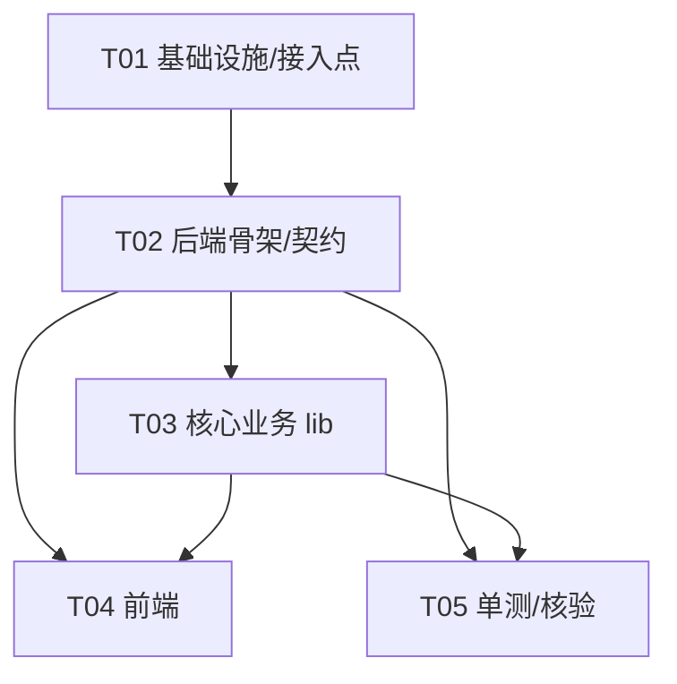

# 素材搜集 material-hub 系统设计方案

> 模块定位：`tools-hub` 第 4 个子模块，与 `kdocs-tool`(:3599) / `netdisk-hub`(:3000) / `biliup-hub`(:3600) 并列。
> 形态：独立 `material-hub/server.js`（Express，监听 `127.0.0.1:3700`）+ `public/`（经主窗口 `<webview>` 打开）+ 自己 `package.json` + `VERSION`。
> 版本号：**v2.2.0**（新增模块 = minor，4 个 `package.json` 统一 bump）。
> 设计者：高见远（架构师）　|　产出性质：**仅设计 + 任务分解，不含实现代码**。

---

## 1. 实现方案与框架选型

### 1.1 核心技术难点
1. **接入现有 Electron 多子进程框架**：`main.js` 用 `CHILDREN` 注册表 `fork` 各 `server.js`，注入 `BOOT_TOKEN`；主进程经 `/api/version` 回显 `bootToken` 做端口防抢占校验（#5 B/C/D）与看门狗探活（#5 A）。material 必须复刻这套契约，否则卡片会被看门狗误判离线/被当成端口抢占。
2. **封面来源策略**：规则要求 ≥1920×1080 官方图、Fankit 优先，但自动化场景下 **Steam CDN 直链（`library_hero.jpg`，恰好 1920×1080）最稳** → 定为主路径；回退用 YouTube 官方宣传片 `maxres` 缩略图（需 yt-dlp）；两者皆失败则**报错而非静默**（决策①）。
3. **宣传片依赖本机 yt-dlp/ffmpeg**：用户环境未装/不确定 → `server.js` 必须**自动检测** PATH 中是否存在，缺失给清晰安装引导；**不崩溃、不阻塞封面下载**，仅宣传片那一项报错（决策⑤）。
4. **严格遵循素材准备规则**：文件夹 `【游戏NNN】游戏名`（编号递增）、封面 `封面.jpg/.png`、宣传片保留原始英文名、`.webm`→`.mp4` 转码、落盘 `E:\素材\`。
5. **UI 严格复刻静态原型**（`material-hub-ui-review.html` 三态：待输入 / 执行中 / 完成），**复用 kdocs 玻璃执行面板 class**（`.auto-result`/`.step-item`/`.log-card`/`.log-area`/`.result-summary`），明暗双主题。
6. **SSE 流式进度**：对标 `biliup-hub /api/upload` 的 SSE 模式，前端实时渲染时间线 + 日志卡 + 结果。

### 1.2 框架与库选型（与 biliup-hub 同构，已验证）
| 关注点 | 选型 | 理由 |
|---|---|---|
| Web 框架 | **Express 5**（`^5.2.1`） | 与 biliup 同构，CommonJS `require`，已被打包验证 |
| 同源校验 | **手写中间件**（照抄 biliup） | 仅放行 `127.0.0.1`/`localhost`/`::1` origin，不引库 |
| HTTP fetch | **Node18+ 全局 `fetch`** | 不引 `node-fetch`/`undici`（biliup 引 undici 仅因代理，material 无需代理）；单测可注入 `globalThis.fetch` |
| 外部 CLI | **`child_process.spawn` 调系统 PATH 的 yt-dlp / ffmpeg** | **不引** yt-dlp、ffmpeg 的 npm 包；缺失即检测报错 |
| 环境变量 | `dotenv`（`^17.4.2`，同 biliup） | `server.js` 顶部 `require('dotenv').config()` |
| 单测 | **Node18+ 内置 `node:test`** | `npm test` 可跑，纯函数不依赖网络/yt-dlp |
| 架构分层 | `server.js`(路由) → `lib/`(业务) → `test/`(纯函数) | 与 biliup `lib/` 分层对齐 |

### 1.3 端口与运行环境
- 端口：**3700**（建议未占用；经 `process.env.MATERIAL_PORT` 注入，缺省 3700）。仅绑定 `127.0.0.1`（同 biliup `app.listen(PORT,'127.0.0.1')`）。
- 启动重试：EADDRINUSE 自动重试 30 次/300ms（同 biliup `startServer`）。
- 优雅关闭 + `uncaughtException`/`unhandledRejection` 仅记录不退出（同 biliup，避免子进程被看门狗误判）。

---

## 2. 文件清单（新建 + 修改）

### 2.1 新建 `material-hub/`（子模块）
| 路径 | 作用 |
|---|---|
| `material-hub/package.json` | 模块元信息 + 依赖（express, dotenv）+ `scripts.test: node --test` + version 2.2.0 |
| `material-hub/VERSION` | 版本号文件，内容 `2.2.0`（沿用 biliup/netdisk 含 VERSION 的惯例；kdocs 无 VERSION，靠 `TOOLSHUB_VERSION` 注入） |
| `material-hub/server.js` | Express 入口：同源中间件 + `express.static('public')` 防缓存 + `/api/version` 回显 bootToken + `/api/collect`(SSE) + 启动重试 + 优雅关闭。`module.exports = app` 便于单测 require |
| `material-hub/lib/logger.js` | 按日滚动日志（**镜像 biliup `lib/logger.js`**，落 `material-hub/logs/app-YYYY-MM-DD.log`） |
| `material-hub/lib/env.js` | `EnvDetector`：检测 `yt-dlp` / `ffmpeg` 是否在 PATH（Windows `where`）；缺失返回安装引导文案 |
| `material-hub/lib/name.js` | `NameResolver`：扫描 `E:\素材\` 下 `【游戏NNN】*` 取最大编号 +1；构造/解析文件夹名 |
| `material-hub/lib/filename.js` | `FilenameSanitizer`：宣传片原始英文名清洗（去非法字符、限长），保留可读英文 |
| `material-hub/lib/steam.js` | `SteamCover`：`storesearch`→`appid`→`library_hero.jpg` 直链下载；维度校验 <1920×1080 则失败；回退 YouTube `maxres` 缩略图 |
| `material-hub/lib/trailer.js` | `TrailerDownloader`：yt-dlp 搜官方宣传片 → 下载 1080p mp4；`.webm` 经 ffmpeg 转 `.mp4` |
| `material-hub/lib/collect.js` | `CollectService`：编排全流程，经 `onEvent(obj)` 发射 SSE 事件（scan/cover/trailer/done/error） |
| `material-hub/public/index.html` | 复刻原型三态结构（`.mod-head`/`.card`/输入区/状态 tabs/三面板），复用 kdocs 玻璃面板 class；经 `<link>` 引 `shared/tokens.css` + 本地 `style.css` |
| `material-hub/public/app.js` | SSE 客户端：调 `/api/collect`、解析 `data:` 事件、渲染步骤时间线 + 日志卡 + 完成态（封面预览 + 视频卡 + 落盘路径）；复用 kdocs SSE 解析逻辑 |
| `material-hub/public/style.css` | 引用 `../shared/tokens.css` 提供 token 单一真源；本地补充 `--field-bg` 与玻璃面板/完成态布局（对齐原型，不写死颜色） |
| `material-hub/test/name.test.js` | `NameResolver` 单测（编号递增/取最大/解析/构造） |
| `material-hub/test/filename.test.js` | `FilenameSanitizer` 单测（清洗/限长/扩展名映射） |
| `material-hub/test/steam.test.js` | `SteamCover` 单测（appid URL 构造、storesearch 解析、维度校验、YouTube 回退分支，注入 fetch mock） |
| `material-hub/test/trailer.test.js` | `TrailerDownloader` 单测（yt-dlp 参数构造、转码条件、文件名清洗，注入 spawn mock） |
| `material-hub/test/env.test.js` | `EnvDetector` 单测（PATH 检测逻辑、缺失引导文案，注入 `spawnWhich` mock） |

### 2.2 修改既有文件（接入点）
| 路径 | 修改点 |
|---|---|
| `package.json`（根） | ① version `2.1.13 → 2.2.0`；② `scripts.test` 链增加 `&& npm --prefix material-hub test`；③ `build.extraResources` 增 `material-hub` 块（`filter` 排除 `node_modules/**/.cache`、`**/*.log`、`logs/**`、`.env`、`.tmp/**`） |
| `main.js` | ① 顶部加 `MATERIAL_DIR = path.join(RES,'material-hub')`；② `CHILDREN.material` 注册（script/cwd/url `:3700`/env `MATERIAL_PORT`+`MATERIAL_OUTPUT_DIR`+`TOOLSHUB_VERSION`）；③ `app.whenReady()` 中 `startChild(CHILDREN.material)`。`BOOT_TOKEN` 已由 `startChild` 统一注入 |
| `renderer/app.js` | ① `TOOLS.material` 注册第 4 张卡片（`key:'material'`、`name:'素材搜集'`、`desc`、 `url:'http://localhost:3700'`、`icon:'🎮'`）；② `renderStatus` 聚合新增 `materialLevel`，一并纳入 `aggregateStatus([...])`（否则第 4 卡片在线/离线不计入入口聚合徽标） |

> 注：`renderer/index.html` **不需改**（卡片由 `app.js` `TOOLS` 注册表动态生成）。

---

## 3. 数据结构与接口

### 3.1 `GET /api/version`（端口防抢占 + 探活基线，必复刻）
请求头无特殊要求；响应（与 biliup 同构）：
```json
{
  "version": "2.2.0",
  "source": "tools-hub",
  "updatable": false,
  "bootToken": "<进程注入的 BOOT_TOKEN，主进程据此校验端口归属>"
}
```
- `version`：优先 `process.env.TOOLSHUB_VERSION`（主进程 `app.getVersion()`），缺省回退读 `VERSION` 文件。
- `bootToken`：`process.env.BOOT_TOKEN`（由 `startChild` 注入），主进程 `verifyChildBoot` 比对。

### 3.2 `POST /api/collect`（核心，SSE 流式）
请求体：
```json
{ "name": "战神4" }
```
响应头：`text/event-stream; charset=utf-8`，`Cache-Control: no-cache, no-transform`，`Connection: keep-alive`，`X-Accel-Buffering: no`。每 3s 发 `: hb` 心跳（同 biliup）保活。

**SSE 事件 schema**（每条 `data: <JSON>\n\n`，`type` 即阶段名，`step/msg/ok/detail?` 为约定字段）：
```jsonc
{
  "type": "scan | cover_search | cover_download | trailer_search | trailer_download | trailer_transcode | done | error | log",
  "step": "人类可读步骤名，如『扫描编号并创建文件夹』",
  "msg":  "进展描述，如『→ 【游戏256】战神4』",
  "ok":   true | false | null,   // true=完成且成功 / false=失败 / null或省略=进行中
  "detail": { }                  // 可选结构化细节
}
```

**示例事件流**（成功）：
```json
{"type":"scan","step":"扫描编号并创建文件夹","msg":"解析下一个编号 → 256","ok":null}
{"type":"scan","step":"扫描编号并创建文件夹","msg":"已创建 E:\\素材\\【游戏256】战神4\\","ok":true,"detail":{"folder":"E:\\素材\\【游戏256】战神4","index":256}}
{"type":"cover_search","step":"搜索封面 (Steam storesearch)","msg":"命中 appid=292030","ok":null,"detail":{"appid":292030,"source":"steam"}}
{"type":"cover_download","step":"下载封面","msg":"GET library_hero.jpg","ok":null}
{"type":"cover_download","step":"下载封面","msg":"封面.jpg (1920×1080)","ok":true,"detail":{"file":"封面.jpg","width":1920,"height":1080,"path":"E:\\素材\\【游戏256】战神4\\封面.jpg"}}
{"type":"trailer_search","step":"搜索官方宣传片 (yt-dlp)","msg":"命中官方频道 1080p","ok":null,"detail":{"title":"God of War (2018) - Launch Trailer"}}
{"type":"trailer_download","step":"下载宣传片","msg":"下载中…","ok":null,"detail":{"url":"https://www.youtube.com/watch?v=xxxx"}}
{"type":"trailer_transcode","step":"转码 .webm → .mp4","msg":"ffmpeg 转码中…","ok":null}
{"type":"trailer_download","step":"下载宣传片","msg":"God_of_War_2018_Launch_Trailer_1080p.mp4","ok":true,"detail":{"file":"God_of_War_2018_Launch_Trailer_1080p.mp4","converted":true}}
{"type":"done","step":"素材搜集完成","msg":"落盘 E:\\素材\\【游戏256】战神4\\","ok":true,"detail":{"folder":"E:\\素材\\【游戏256】战神4","index":256,"coverOk":true,"trailerOk":true,"cover":{"file":"封面.jpg","width":1920,"height":1080},"trailer":{"file":"God_of_War_2018_Launch_Trailer_1080p.mp4","converted":true}}}
```

**示例事件流**（yt-dlp 缺失，仅宣传片报错，封面已落盘、不崩溃）：
```json
{"type":"scan","step":"扫描编号并创建文件夹","msg":"已创建 E:\\素材\\【游戏257】黑神话悟空\\","ok":true,"detail":{"index":257}}
{"type":"cover_download","step":"下载封面","msg":"封面.jpg (1920×1080)","ok":true,"detail":{"file":"封面.jpg"}}
{"type":"error","step":"下载官方宣传片","msg":"未检测到 yt-dlp，无法下载宣传片","ok":false,"detail":{"reason":"yt-dlp-not-found","guidance":"pip install yt-dlp  或  https://github.com/yt-dlp/yt-dlp#installation"}}
{"type":"done","step":"素材搜集完成（封面已落盘，宣传片缺失）","msg":"落盘 E:\\素材\\【游戏257】黑神话悟空\\","ok":true,"detail":{"coverOk":true,"trailerOk":false}}
```

**示例事件流**（封面两源皆失败 → 报错不静默）：
```json
{"type":"cover_search","step":"搜索封面 (Steam storesearch)","msg":"storesearch 无命中","ok":null}
{"type":"error","step":"下载封面","msg":"Steam 与 YouTube 缩略图均获取失败","ok":false,"detail":{"reason":"cover-both-failed"}}
```

> 前端映射约定：`ok===true`→步骤绿(`.st-luxe--ok`)；`ok===false`→红(`.st-luxe--err`)；`ok` 为 null/省略→进行中(`.st-luxe--info`)。`type==='done'` 为终态，`type==='error'` 为单步失败（流程继续，除非封面两源全失败则整体 success=false）。`type==='log'` 用于把 yt-dlp/ffmpeg 原始输出行推到 `.log-area`。

### 3.3 类图（详见 `material-hub-class.mermaid`）
- `CollectService.run(opts, handlers) → Result`：编排全流程，`emit(type, step, msg, ok, detail)` 调 `handlers.onEvent`。
- `NameResolver`：`scanMaxIndex(outputDir)`、`buildFolderName(index, name)`、`parseIndexFromFolder(name)`。
- `FilenameSanitizer`：`sanitize(raw)`、`extForFormat(fmt)`、`truncate(raw, max)`。
- `SteamCover`：`searchAppId(term, {cc,l})`、`heroUrl(appid)`、`fetchCover(term, outDir, opts)`（含 `fetchYouTubeThumbnail` 回退）。
- `TrailerDownloader`：`searchTrailer(name)`、`download(name, dir, env)`、`transcodeIfNeeded(file, dir, env)`。
- `EnvDetector`：`detect() → {ytDlp, ffmpeg, guidance}`、`spawnWhich(cmd)`。
- `Result`：`{folder, index, cover, trailer, success, coverOk, trailerOk}`。

---

## 4. 程序调用流程（时序图，详见 `material-hub-sequence.mermaid`）

关键路径：
1. 用户在前端输入游戏名 → `POST /api/collect {name}`。
2. `server.js` 开 SSE + 心跳，调 `CollectService.run({name, outDir, env}, {onEvent: send})`。
3. **scan**：`NameResolver.scanMaxIndex` 扫 `E:\素材\【游戏NNN】*` → 最大 +1 → `mkdir` → 发 `scan` ok。
4. **cover**：`SteamCover.fetchCover` → `storesearch` 取 `appid` → `GET library_hero.jpg`（维度校验 ≥1920×1080）→ 发 `cover_search`/`cover_download`；失败回退 yt-dlp 取官方宣传片 `maxres` 缩略图；都失败发 `error`（不静默）。
5. **trailer**：先 `EnvDetector.detect()`；
   - yt-dlp 缺失 → 发 `error`（trailer）带安装引导，**仅此项报错，封面已落盘，不崩溃**；
   - 可用 → `searchTrailer` → `download`（保留原始英文名；落 `.webm` 且 ffmpeg 可用则 `transcodeIfNeeded` 转 `.mp4`）→ 发 `trailer_search`/`trailer_download`/`trailer_transcode`。
6. 发 `done`（含 `detail.folder/cover/trailer/coverOk/trailerOk`）→ `res.end()`。
7. 启动后主进程 `verifyChildBoot` 经 `/api/version` 比对 `BOOT_TOKEN` 校验端口归属。

---

## 5. 共享知识（跨文件约定）

- **token 引用路径**：前端 `public/index.html` 经 `<link rel="stylesheet" href="../shared/tokens.css">` 引入（子工具走 http，相对 `public/` 上层到 `shared/`）；本地仅补充 `--field-bg` 与玻璃面板/完成态布局，**绝不写死颜色**（对齐 `shared/tokens.css` 单一真源）。明暗双主题由 `data-theme="dark|light"` 驱动。
- **主题唯一真源（重要）**：`webview-preload.js` 会**隐藏页面内 `#themeBtn`** 并自动把 `data-theme` 从工具箱壳注入到内嵌页（`sync-theme` IPC）。因此 material 页**不渲染独立主题切换按钮**（与 kdocs/netdisk/biliup 保持一致），主题完全由壳控制。原型里的 `🌗` 按钮需移除或作为被隐藏占位。
- **bootToken 校验**：`/api/version` 必须回显 `process.env.BOOT_TOKEN`；主进程据此做端口防抢占 + 看门狗探活。`server.js` 仅在 `require.main === module` 时真正监听端口，被 `require` 时不占用端口（便于单测）。
- **同源校验**：手写中间件，origin 非 `127.0.0.1`/`localhost`/`::1` 一律 403（照抄 biliup，不可省略，否则 CSRF 防护缺失）。
- **静态资源防缓存**：`express.static('public')` 对 `.js/.css/.html/.htm` 设 `Cache-Control: no-cache`（避免浏览器长期缓存旧 `app.js`）。
- **版本号统一**：4 个 `package.json`（根 + kdocs-tool + netdisk-hub + biliup-hub + **material-hub**）统一 bump 到 `2.2.0`；`material-hub/VERSION` 写 `2.2.0`。根 `package.json` `scripts.test` 须含 `npm --prefix material-hub test`。
- **端口分配**：kdocs 3599 / netdisk 3000 / biliup 3600 / **material 3700**。均经 `process.env.<MOD>_PORT` 注入，仅绑 `127.0.0.1`。
- **落盘目录**：`process.env.MATERIAL_OUTPUT_DIR`（默认 `E:\素材\`），经 `main.js` 注入；`CollectService` 创建文件夹时自动 `mkdir -p`（无单点故障）。
- **SSE 帧格式**：`res.write('data: ' + JSON.stringify(obj) + '\n\n')`，前端用 `data: ` 前缀 + `\n\n` 切分解析（与 kdocs `app.js` SSE 解析逻辑一致）；心跳 `: hb\n\n` 每 3s。
- **日志**：`lib/logger.js` 镜像 biliup，落 `material-hub/logs/`，按日滚动、14 天保留；前端进度日志直接转发 child_process 输出行。

---

## 6. 任务列表（有序 + 依赖，≤5 个，按模块分组）

> 规则遵守：首任务 = 项目基础设施；每任务 ≥3 文件；按模块/层次分组；尽量仅依赖 T01/T02。

| Task | 名称 | 源文件 | 依赖 | 优先级 |
|---|---|---|---|---|
| **T01** | 项目基础设施与接入点 | `package.json`(根)、`main.js`、`renderer/app.js` | — | P0 |
| **T02** | material-hub 后端骨架与契约 | `material-hub/package.json`、`material-hub/VERSION`、`material-hub/server.js`、`material-hub/lib/logger.js` | T01 | P0 |
| **T03** | 核心业务逻辑 lib | `material-hub/lib/env.js`、`material-hub/lib/name.js`、`material-hub/lib/filename.js`、`material-hub/lib/steam.js`、`material-hub/lib/trailer.js`、`material-hub/lib/collect.js` | T02 | P0 |
| **T04** | 前端（严格复刻原型 + 复用玻璃面板） | `material-hub/public/index.html`、`material-hub/public/app.js`、`material-hub/public/style.css` | T02, T03 | P1 |
| **T05** | 单元测试 + 集成核验 | `material-hub/test/name.test.js`、`material-hub/test/filename.test.js`、`material-hub/test/steam.test.js`、`material-hub/test/trailer.test.js`、`material-hub/test/env.test.js` | T02, T03 | P1 |

### T01 详情（项目基础设施与接入点）
- 根 `package.json`：`version` → `2.2.0`；`scripts.test` 追加 `&& npm --prefix material-hub test`；`build.extraResources` 增加 `material-hub` 块（filter：`**/*`、`!node_modules/**/.cache`、`!**/*.log`、`!logs/**`、`!**/.env`、`!.tmp/**`）。
- `main.js`：增 `MATERIAL_DIR`；`CHILDREN.material`（`script`/`cwd`/`url:http://localhost:3700`/`env: {MATERIAL_PORT:'3700', MATERIAL_OUTPUT_DIR:'E:\\素材\\', TOOLSHUB_VERSION}`）；`app.whenReady()` 中 `startChild(CHILDREN.material)`。
- `renderer/app.js`：增 `TOOLS.material`（第 4 卡片）；`renderStatus` 聚合补 `materialLevel` 纳入 `aggregateStatus([...])`。

### T02 详情（后端骨架与契约）
- `server.js`：同源中间件 + `express.static` 防缓存 + `/api/version` 回显 bootToken + `/api/collect`(SSE：开流/心跳/`CollectService.run`/`res.end`) + EADDRINUSE 重试 30×300ms + 优雅关闭 + `uncaughtException`/`unhandledRejection` 仅记录 + `module.exports = app`。
- `lib/logger.js`：镜像 biliup（按日滚动、14 天清理）。
- `package.json`/`VERSION`：2.2.0、依赖 express+dotenv、`test: node --test`。

### T03 详情（核心业务逻辑 lib）
- `env.js`：`detect()`（Windows `where yt-dlp`/`where ffmpeg`）+ 安装引导文案。
- `name.js`：`scanMaxIndex`/`buildFolderName`/`parseIndexFromFolder`。
- `filename.js`：`sanitize`/`extForFormat`/`truncate`。
- `steam.js`：`searchAppId`/`heroUrl`/`fetchCover`（含维度校验 + YouTube 缩略图回退）。
- `trailer.js`：`searchTrailer`/`download`/`transcodeIfNeeded`（spawn yt-dlp/ffmpeg）。
- `collect.js`：`run(opts, handlers)` 编排并 `emit` 全部 SSE 事件。

### T04 详情（前端）
- `index.html`：复刻原型三态；移除独立主题按钮（壳控制）；引 `shared/tokens.css` + `style.css`；复用 `.auto-result`/`.step-item`/`.log-card`/`.log-area`/`.result-summary`。
- `app.js`：输入校验→`fetch('/api/collect',{method:'POST',body:{name}})`→SSE `data:` 解析→渲染步骤时间线 + 日志卡 + 完成态（封面预览 + 视频卡 + 落盘路径）；复刻 kdocs SSE 解析与 `addLog`。
- `style.css`：`@import`/`link` tokens + `--field-bg` + 玻璃面板/完成态布局。

### T05 详情（单测 + 核验）
- 5 个 `test/*.test.js` 覆盖纯函数（编号递增/解析、文件名清洗、Steam URL 构造与 storesearch 解析、yt-dlp 参数构造、环境检测逻辑），注入 `fetch`/`spawn` mock，**不依赖 yt-dlp/网络**。
- 联调：根 `npm test` 全绿；`main.js` 拉起后第 4 卡片在线、点开可搜集、看门狗不误判。

### 任务依赖图


---

## 7. 依赖包列表

### `material-hub/package.json` 依赖
```
- express@^5.2.1      # Web 框架（与 biliup 同构）
- dotenv@^17.4.2      # 环境变量加载（server.js 顶部 require('dotenv').config()）
```
> 不引入 yt-dlp / ffmpeg 的 npm 包（走 `child_process.spawn` 调系统 PATH 二进制）。
> 不引入 `undici`/`node-fetch`（用 Node18+ 全局 `fetch`）。
> 单测用内置 `node:test`，无额外 devDependency。

### 根 `package.json` 依赖（仅版本 bump，无新增）
```
- electron-updater@^6.3.0   # 既有
```

---

## 8. 待明确事项（设计取舍 / 需主理人拍板）

1. **主题按钮冲突（原型 vs 架构）**：静态原型含 in-page `🌗` 主题按钮，但 `webview-preload.js` **强制隐藏 `#themeBtn`** 且工具箱是唯一主题源（自动 `sync-theme`）。本设计按既有三端约定**移除 material 页独立主题按钮**。需确认：原型按钮是否保留为「被隐藏的占位」（视觉一致但无效）还是直接删去——建议直接删去以免误导。
2. **现状版本号不一致**：根/`biliup` `package.json` 当前为 `2.1.13`，但 `biliup/VERSION=0.1.66`、`netdisk/VERSION=1.3.32` 与包版本脱节；`kdocs` 无 `VERSION` 文件（靠 `TOOLSHUB_VERSION` 注入）。本设计执行「4 个 `package.json` 统一 bump 到 2.2.0」+ 新增 `material-hub/VERSION=2.2.0`。需确认：是否也把 `biliup/VERSION`、`netdisk/VERSION` 一并对齐到 2.2.0（消除脱节），还是维持子模块内部版本独立。
3. **Fankit 增强未纳入首版**：规则优先级①是官方 Fankit/Press Kit，但自动化场景 Steam CDN 直链最稳，故主路径定为 Steam，Fankit 关键词检索作为「备注可选增强」未排入首版。需确认首版是否就要做 Fankit 检索（会增加复杂度与误命中风险）。
4. **输出目录不存在时的行为**：`MATERIAL_OUTPUT_DIR`（默认 `E:\素材\`）若不存在，本设计**自动 `mkdir -p`**（无单点故障）。需确认：自动创建父目录是否符合用户预期，还是应报错提示用户手动建目录。
5. **编号递增并发安全**：扫 `E:\素材\【游戏NNN】*` 取最大 +1，理论快速连点（同毫秒）可能复用同一编号/文件夹。本设计采用「计算出编号即 `mkdir`，失败则 +1 重试」缩小窗口，但**非严格文件锁**。需确认是否需要严格防重（如 `.lock` 文件 / 原子目录创建重试上限）。
6. **YouTube 缩略图回退的前提**：封面回退路径（Steam 失败）依赖 yt-dlp 取宣传片 `maxres` 缩略图。若 yt-dlp 也缺失，则封面只剩「两源皆失败→报错」。需确认该回退优先级是否可接受（即 Steam 失败即要求 yt-dlp 可用），还是应改为「Steam 失败→报错」，不做缩略图回退。
7. **宣传片文件名清洗规则**：规则要求「保留原始英文文件名」。yt-dlp 默认输出模板含标题（可能含 `/ \ : * ? " < > |` 等非法字符）。`FilenameSanitizer` 需清洗非法字符为 `_`、限长（如 180 字符）、保留可读英文名。需确认清洗细则（是否保留空格、是否去重后缀）。
8. **打包 extraResources 范围**：`material-hub` 写入 `E:\素材\`（app 外），无需像 netdisk 做 `userData` 重定向；但会写 `material-hub/logs/`（按 biliup 惯例排除于打包）。需确认是否排除 `logs/**` 与其他临时产物，避免安装包膨胀。
