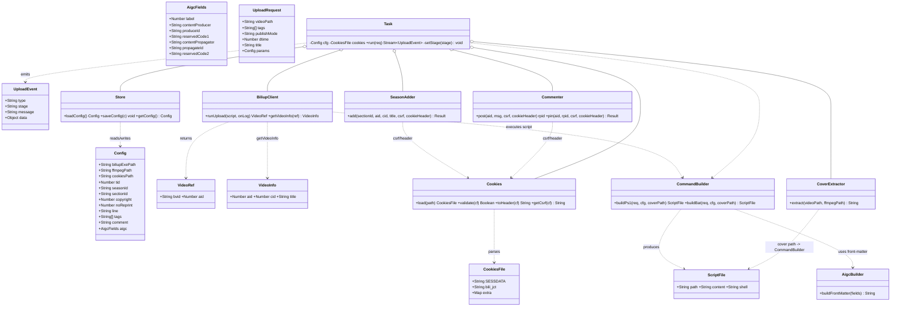
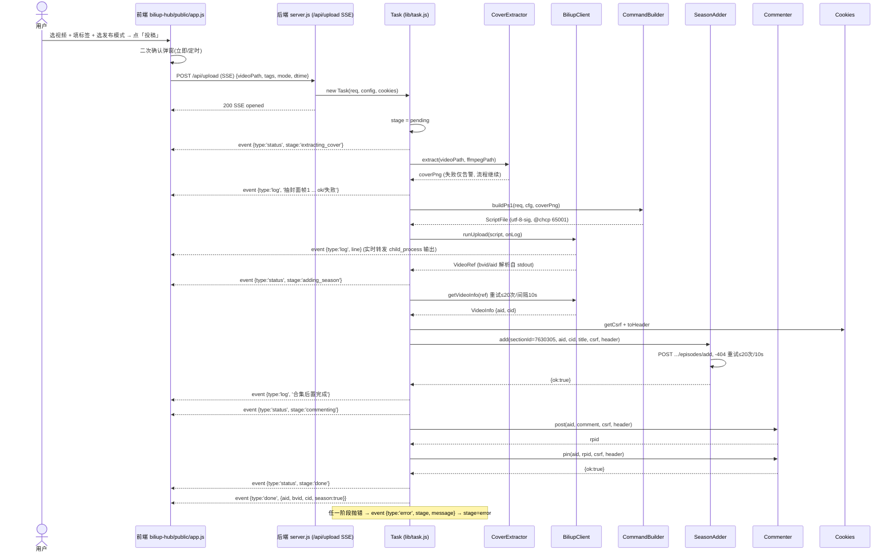
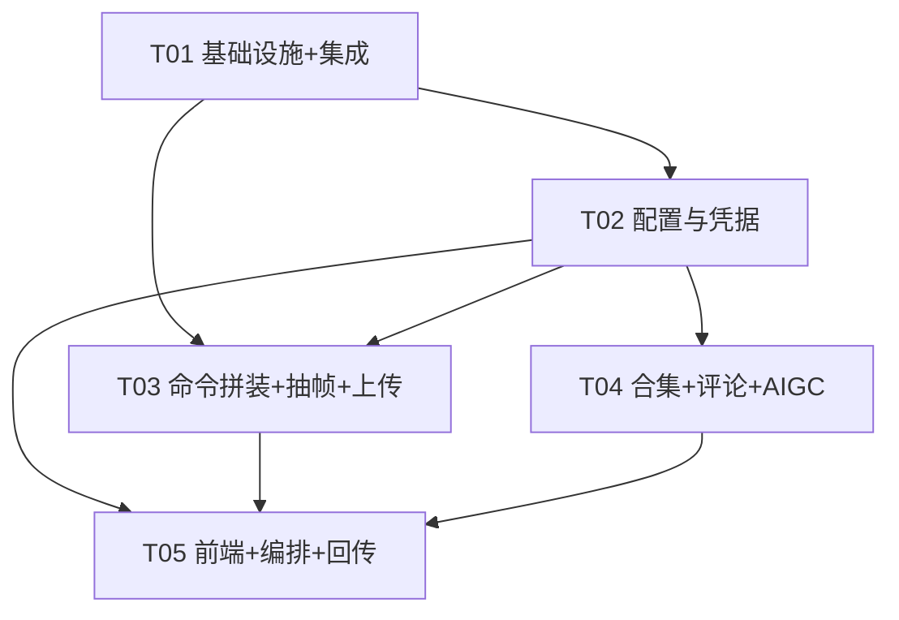

# 系统架构设计 + 任务分解：B站自动投稿（biliup-hub）

> 架构师：高见远（Bob）｜ 工具箱：tools-hub（Electron，git v0.1.58）｜ 团队：software-biliup-hub
> 配套文档：`docs/class-diagram.mermaid`（类图）、`docs/sequence-diagram.mermaid`（时序图）
> 本文档可直接转交工程师 **寇豆码** 实现。所有结论已吸收主理人裁决与 PRD 约束。

---

## 1. 实现方案 + 框架选型

### 1.1 技术栈（已定，沿用现有同构）

| 层 | 技术 | 说明 |
|---|---|---|
| 主进程 | Electron `main.js` | 经 `CHILDREN` 注册表 `fork` 子进程；端口防抢占（bootToken） |
| 子服务 | **原生 Node + Express**（非 Vite/React） | 监听 `127.0.0.1:3600`，与 `netdisk-hub`（3000）/ `kdocs-tool`（3599）同构 |
| 编排逻辑 | Node `child_process` 调 `biliup.exe` | 重写为临时脚本文件执行（绕开 `--extra-fields` 坑），**不复用** `D:\biliupR` 的 `.ps1/.bat` |
| 前端 | **原生 HTML/CSS/JS** + `shared/status-luxe` | macos 玻璃拟态，与网盘/金山前端一致；复用 status-luxe（复制为第 4 副本） |
| 外部二进制 | `biliup.exe` / `ffmpeg` / `cookies.json` | 路径全部 UI 可配，不硬编码 `D:\` |

> 为什么不用 Vite/React：主进程以 `<webview>` 内嵌子服务页面，现有两套工具均用原生 + status-luxe，biliup-hub 必须**同构**以保证视觉/流程/构建链路一致。

### 1.2 biliup-hub 子服务进程模型

```
main.js (Electron)
  └─ CHILDREN.biliup = { key, name, script, cwd:'biliup-hub', url:'http://localhost:3600', env }
       └─ fork('biliup-hub/server.js', [], { cwd, env:{TOOLSHUB_VERSION, BILIUP_PORT='3600', BILIUP_DATA_DIR, BOOT_TOKEN}, execPath: NODE_BIN })
            └─ Express 监听 127.0.0.1:3600（仅本机，EADDRINUSE 自动重试 30 次）
                 ├─ 同源校验中间件（阻断跨站 CSRF）
                 ├─ /api/version（回显 bootToken 供主进程 verifyChildBoot 校验）
                 ├─ /api/health  /api/live
                 ├─ /api/config (GET/POST)  配置持久化
                 ├─ /api/cookies/check       校验 cookies.json
                 └─ POST /api/upload         SSE 流式进度（核心全流程）
```

- **生命周期**：与 netdisk/kdocs 完全一致 —— `startChild()` 拉起、`exit` 后 2s 重启（≤5 次）、`before-quit` 由 `stopAllChildren()` 统一 SIGTERM。
- **端口防抢占**：`/api/version` 回显 `process.env.BOOT_TOKEN`；主进程 `verifyChildBoot()` 比对不一致即告警。
- **数据目录**：打包后由主进程注入 `BILIUP_DATA_DIR`（指向 `userData/biliup-hub/data`）；开发模式回退 `biliup-hub/data/`。`.env`/`data/`/`logs/` 不进 git（`.gitignore`）。

### 1.3 关键坑点内建机制（设计强制项）

| 坑点 | 设计对策 |
|---|---|
| `--extra-fields` 在 subprocess 列表模式不生效 | 完整命令写入**临时脚本文件**再执行；优先 `.ps1`（`utf-8-sig` + 头部 `@chcp 65001` + 反引号 `` ` `` 转义双引号、` `n ` 换行）。bat 仅作兜底（`""` 转义，且不支多行 desc → 多行场景一律走 ps1）。执行：`child_process.execFile('powershell', ['-NoProfile','-ExecutionPolicy','Bypass','-File', tmp])` |
| 合集 `season_id` 被 App 投稿接口忽略 | 投稿成功后用独立 API 后置：`POST https://member.bilibili.com/x2/creative/web/season/section/episodes/add`，参数 **`sectionId=7630305`**（非 season_id）、`episodes=[{aid,cid,title,charging_pay:0}]`，带 `csrf=bili_jct` + 完整 Cookie 头 |
| 简介多行 | ps1 的 desc 用 `` `n `` 拼接；文件 `utf-8-sig` |
| 上传后 API 索引延迟（返回 -404） | `getVideoInfo`（取 aid/cid）与合集添加均**重试 ≤20 次、间隔 10s**（约 3 分钟） |

---

## 2. 文件列表及相对路径

### 2.1 新建文件（biliup-hub/）

| 文件 | 职责 |
|---|---|
| `biliup-hub/package.json` | 子服务依赖（express / undici / dotenv）+ 脚本（start/dev/test） |
| `biliup-hub/VERSION` | 版本号（同 netdisk，被 `/api/version` 读取；主进程注入 `TOOLSHUB_VERSION` 时以注入为准） |
| `biliup-hub/.gitignore` | 忽略 `logs/ data/ .tmp/ .env node_modules/` |
| `biliup-hub/.env.example` | 示例环境变量（`BILIUP_PORT` 等） |
| `biliup-hub/server.js` | Express 子服务入口：同源校验、静态资源、版本/健康检查、配置/凭据路由、`/api/upload` SSE 路由；绑定 3600，EADDRINUSE 重试 |
| `biliup-hub/lib/logger.js` | 日志（复用 netdisk 模式：按日滚动写 `logs/app-YYYY-MM-DD.log`，stdout 同显） |
| `biliup-hub/lib/store.js` | 配置持久化（`data/config.json` 读写，内存缓存 + 串行刷盘） |
| `biliup-hub/lib/cookies.js` | 加载/校验 `cookies.json`（必须含 `SESSDATA`+`bili_jct`）、拼装 Cookie 头字符串与 csrf |
| `biliup-hub/lib/command.js` | **核心坑点**：拼装临时 `.ps1`/`.bat` 脚本内容（utf-8-sig、转义、多行 desc） |
| `biliup-hub/lib/cover.js` | ffmpeg 抽帧（探测 ffmpeg 路径；`-ss 00:00:01 -vframes 1`；失败仅告警不阻断） |
| `biliup-hub/lib/biliup.js` | 执行上传（`execFile` 跑临时脚本、解析 stdout 拿 bvid/aid）、`getVideoInfo` 重试 20×10s |
| `biliup-hub/lib/season.js` | 合集后置 API 调用 + 重试 20×10s（处理 -404） |
| `biliup-hub/lib/comment.js` | 评论发布 + 置顶（B站 reply API） |
| `biliup-hub/lib/aigc.js` | 拼装 AIGC YAML front-matter 字符串（每次投稿必注入） |
| `biliup-hub/lib/task.js` | **任务状态机 + SSE 事件编排**：串联 cover→upload→season→comment，逐阶段 emit 事件 |
| `biliup-hub/public/index.html` | 前端页面：顶部标题+status-luxe 胶囊、三栏（选视频/标签+模式/可折叠参数）、底部「投稿」+二次确认弹窗+进度日志；内联 shared tokens/macos-motion + 引用 `macos.css`/`status-luxe.css` |
| `biliup-hub/public/app.js` | 前端逻辑：`electronAPI.pickFile()` 选视频、参数读写、发布模式+二次确认、`fetch('/api/upload')` 消费 SSE、渲染进度日志与状态胶囊 |
| `biliup-hub/public/macos.css` | 复制自 `netdisk-hub/public/macos.css`（macos 玻璃样式引用） |
| `biliup-hub/public/status-luxe.css` | 复制自 `shared/status-luxe`（第 4 副本，纳入 sync 校验） |
| `biliup-hub/public/status-luxe.js` | 复制自 `shared/status-luxe`（第 4 副本） |
| `biliup-hub/test/command.test.js` | command.js 单测（断言 ps1 内容/转义/utf-8-sig；mock `child_process` 或 `fs`） |
| `biliup-hub/test/biliup.test.js` | biliup.js 单测（上传解析、getVideoInfo 重试 20×10s；mock `child_process`） |
| `biliup-hub/test/season.test.js` | season.js 单测（合集添加、-404 重试；mock `undici`/`fetch`） |
| `biliup-hub/test/comment.test.js` | comment.js 单测（发布+置顶；mock `undici`/`fetch`） |

### 2.2 修改文件（集成点）

| 文件 | 改动 |
|---|---|
| `main.js` | ① `CHILDREN` 增加 `biliup`（端口 3600、cwd、env 注入 `BILIUP_PORT`/`BILIUP_DATA_DIR`/`BOOT_TOKEN`）；② `app.whenReady` 中 `startChild(CHILDREN.biliup)`；③ 新增 `ipcMain.handle('pick-file', …)`（用 `dialog.showOpenDialog` 选单个 mp4） |
| `renderer/app.js` | `TOOLS` 注册表增加 `biliup`（key/name/desc/url/icon）；`renderStatus` 聚合可纳入 `biliup` 运行态（可选，建议加以保证聚合胶囊准确） |
| `webview-preload.js` | `contextBridge` 暴露 `pickFile: () => ipcRenderer.invoke('pick-file')`（现有 `pickFolder` 供 P1-4 文件夹选择复用） |
| `scripts/sync-status-luxe.js` | `COPIES` 增加 `{ name:'biliup-hub', dir:'biliup-hub/public' }`（三处→四处） |
| `scripts/verify-status-luxe-sync.js` | `COPIES` 同步增加 `biliup-hub/public`；日志文案「四处一致」 |
| `package.json`（根） | `build.extraResources` 增加 `{ from:'biliup-hub', to:'biliup-hub', filter:[…!data/**,!logs/**,!**/.env,…] }`；`scripts.test` 可追加 `npm --prefix biliup-hub test` |

---

## 3. 数据结构与接口

### 3.1 类图（详见 `docs/class-diagram.mermaid`）



### 3.2 关键数据结构（JSON Schema）

**Config（持久化于 `data/config.json`）**
```json
{
  "biliupExePath": "D:\\biliupR\\biliup.exe",
  "ffmpegPath": "",
  "cookiesPath": "D:\\biliupR\\cookies.json",
  "tid": 17,
  "seasonId": "6918057",
  "sectionId": "7630305",
  "copyright": 1,
  "noReprint": 1,
  "line": "bda2",
  "tags": [],
  "comment": "老规矩！！！三连后关注私信自动回复下载方式",
  "aigc": {
    "label": 1,
    "contentProducer": "",
    "produceId": "",
    "reservedCode1": "",
    "contentPropagator": "",
    "propagateID": "",
    "reservedCode2": ""
  }
}
```

**CookiesFile（解析自 `cookies.json`）**
```json
{ "SESSDATA": "xxxx", "bili_jct": "yyyy", "<其他b站cookie键>": "<值>" }
```
> 校验：`SESSDATA` 与 `bili_jct` 必须同时存在，否则 `/api/cookies/check` 返回 `ok:false` 并指引用户补。

**UploadRequest（POST `/api/upload` body）**
```json
{
  "videoPath": "E:\\素材\\【游戏252】潜水员戴夫 官方中文+全DLC.mp4",
  "tags": ["辐射4", "单机游戏", "RPG"],
  "publishMode": "now" | "dtime",
  "dtime": 1700000000,
  "title": "【游戏252】潜水员戴夫 官方中文+全DLC...",
  "params": { "/* 可选：覆盖 Config 中单项，如本次临时改 tid */" }
}
```

**UploadEvent（SSE `data:` 推送，每行一个 JSON）**
```json
{ "type": "log",     "stage": "uploading",        "message": "进度 62% ..." }
{ "type": "status",  "stage": "extracting_cover", "message": "抽封面帧1" }
{ "type": "status",  "stage": "adding_season",    "message": "合集后置重试 3/20 (-404)" }
{ "type": "done",    "stage": "done",             "data": { "aid": 123, "bvid": "BV1xx", "cid": 456, "season": true } }
{ "type": "error",   "stage": "adding_season",    "message": "合集添加失败：..." }
```

**SeasonAddRequest（合集后置 API）**
```
POST https://member.bilibili.com/x2/creative/web/season/section/episodes/add
Headers: Cookie: <完整cookie头(含SESSDATA)>
Body(form): sectionId=7630305 & csrf=<bili_jct>
           & episodes=[{"aid":123,"cid":456,"title":"...","charging_pay":0}]
```

### 3.3 前端 ↔ 后端 接口清单

| 方法 | 路径 | 说明 | 响应 |
|---|---|---|---|
| GET | `/api/version` | 版本 + bootToken（主进程校验端口归属） | `{version, source, updatable:false, bootToken}` |
| GET | `/api/health` `/api/live` | 存活/就绪探针 | `{ok, ts, port:3600, bind:'127.0.0.1'}` |
| GET | `/api/config` | 读取当前配置 + cookies 状态 | `Config & { cookiesOk:boolean }` |
| POST | `/api/config` | 保存配置（路径/默认参数/AIGC 字段） | `{ok:true}` |
| GET | `/api/cookies/check` | 校验 cookies.json 含 `SESSDATA`+`bili_jct` | `{ok, hasSESSDATA, hasBiliJct}` |
| POST | `/api/upload` | **SSE 全流程投稿**（核心） | `text/event-stream`，逐行 `UploadEvent` |

> 前端原生能力：`window.electronAPI.pickFile()`（选 mp4）→ `main.js` `pick-file` IPC → `dialog.showOpenDialog({properties:['openFile'], filters:[{name:'视频',extensions:['mp4']}]})`。

---

## 4. 程序调用流程（详见 `docs/sequence-diagram.mermaid`）



**状态机（后端 `Task`）**
```
pending → extracting_cover → uploading → adding_season → commenting → done
   │            │                │             │              │
   └────────────┴────────────────┴─────────────┴──────────────┴──→ error（任意阶段，附 stage+message）
```
> 设计裁决：封面帧在 `uploading` **之前**抽取（封面是 biliup 投稿参数，且 `--extra-fields` 已废，无法后置注入），与 PRD P0-1 文字顺序略有差异但更稳健；AIGC 头随 desc 在 `uploading` 阶段一并提交。

---

## 5. 任务列表（有序、含依赖、按实现顺序）

> 规则：≤5 个任务，每个任务 ≥3 文件，按功能/层次分组；T01 必为「项目基础设施」。
> QA 重点：lib 内 `command.js`/`biliup.js`/`season.js`/`comment.js` 用 **mock `child_process` / mock `undici`** 覆盖命令拼装、重试、合集/评论逻辑（见各任务标注）。

### T01 · 项目基础设施 + 集成点（P0）
- **依赖**：无
- **文件**：`biliup-hub/package.json`、`biliup-hub/VERSION`、`biliup-hub/.gitignore`、`biliup-hub/.env.example`、`biliup-hub/server.js`（Express 骨架 + 同源校验 + `/api/version` 回显 bootToken + 3600 绑定 + EADDRINUSE 重试）、`main.js`（CHILDREN.biliup + `pick-file` IPC + `app.whenReady` 启动）、`renderer/app.js`（TOOLS.biliup）、`webview-preload.js`（`pickFile`）、`scripts/sync-status-luxe.js`（四处）、`scripts/verify-status-luxe-sync.js`（四处）、`package.json`（根，extraResources 增 biliup-hub）
- **交付**：服务可起、卡片可点开、status-luxe 第 4 副本纳入门禁、选文件对话框可用。

### T02 · 配置与凭据层（P0）
- **依赖**：T01
- **文件**：`biliup-hub/lib/logger.js`、`biliup-hub/lib/store.js`、`biliup-hub/lib/cookies.js`、`biliup-hub/server.js`（`/api/config` GET/POST、`/api/cookies/check` 路由）
- **交付**：配置持久化、cookies 加载/校验/拼装 Cookie 头与 csrf。

### T03 · biliup 编排核心：命令拼装 + 抽帧 + 上传（P0，坑点核心）
- **依赖**：T01, T02
- **文件**：`biliup-hub/lib/command.js`、`biliup-hub/lib/cover.js`、`biliup-hub/lib/biliup.js`、`biliup-hub/test/command.test.js`、`biliup-hub/test/biliup.test.js`
- **QA 重点（mock `child_process`）**：ps1 内容为 `utf-8-sig`、头部 `@chcp 65001`、双引号反引号转义、desc 多行 `` `n ``；biliup stdout 解析出 bvid/aid；`getVideoInfo` 重试 20×10s 且遇 -404 正确重试。

### T04 · 合集后置 + 评论置顶 + AIGC（P0）
- **依赖**：T02
- **文件**：`biliup-hub/lib/aigc.js`、`biliup-hub/lib/season.js`、`biliup-hub/lib/comment.js`、`biliup-hub/test/season.test.js`、`biliup-hub/test/comment.test.js`
- **QA 重点（mock `undici`/`fetch`）**：合集 `sectionId=7630305` + `episodes=[{aid,cid,title,charging_pay:0}]` + csrf + 完整 Cookie 头；-404 重试 20×10s；评论发布拿到 rpid 后置顶（action=3）。

### T05 · 前端 UI + 全流程编排 + 进度回传（P0）
- **依赖**：T02, T03, T04
- **文件**：`biliup-hub/lib/task.js`（状态机 + SSE 编排，串联 T02–T04）、`biliup-hub/public/index.html`、`biliup-hub/public/app.js`、`biliup-hub/public/status-luxe.css`、`biliup-hub/public/status-luxe.js`、`biliup-hub/public/macos.css`、`biliup-hub/server.js`（`/api/upload` SSE 路由接 `Task.run`）
- **交付**：选视频→填标签→选模式→二次确认→投稿→实时进度日志→状态胶囊（空闲/抽帧中/上传中/合集后置中/成功/失败）。

### 任务依赖图


---

## 6. 依赖包列表

`biliup-hub/package.json`（与现有 `netdisk-hub/package.json` 结构一致，独立 `node_modules`）：

```
- express@^5.2.1        # 子服务 HTTP 框架（与 netdisk 同版本）
- undici@^7.28.0        # 调用 B站 API（fetch + 可选 ProxyAgent）；与 netdisk 同版本
- dotenv@^17.4.2        # 读取 .env（与 netdisk 同版本）
```

> **外部二进制（非 npm 依赖，路径 UI 可配）**：`biliup.exe`（默认 `D:\biliupR\biliup.exe`）、`ffmpeg`（默认空 → 探测 biliup 同目录/PATH）、`cookies.json`（默认 `D:\biliupR\cookies.json`）。
> **不引入**：`node-cron`（P2 定时扫描才需要，v1 不做）；`form-data`（B站 API 多为 query/form 直拼，无需额外库）；`node-fetch`（已有 undici）。
> 测试用 Node 内置 `node:test`，无需额外依赖。

---

## 7. 共享知识（跨文件约定）

- **端口**：`3600`（仅 `127.0.0.1` 绑定；`EADDRINUSE` 自动重试 30 次/300ms）。
- **bootToken 机制**：主进程 `crypto.randomBytes(16).toString('hex')` 注入 `BOOT_TOKEN` 环境变量；`/api/version` 回显；主进程 `verifyChildBoot()` 比对不一致即安全告警（端口防抢占）。
- **status-luxe 复制与同步**：复制 `shared/status-luxe/{status-luxe.css,status-luxe.js}` 到 `biliup-hub/public`（**第 4 副本**）；`scripts/sync-status-luxe.js` 与 `scripts/verify-status-luxe-sync.js` 的 `COPIES` 由三处扩为**四处**；`npm run verify:status-luxe` 门禁必须全绿（真源与四副本逐字节一致）。
- **临时脚本目录**：`biliup-hub/.tmp/`（`.gitignore`，启动时清理）；`fs.writeFileSync(path, content, { encoding: 'utf-8-sig' })`；ps1 头部 `@chcp 65001 >nul`。bat 仅兜底（不支持多行 desc）。
- **日志格式**：`[ISO时间] [LEVEL] 消息`（LEVEL: INFO/WARN/ERROR/DEBUG），落 `biliup-hub/logs/app-YYYY-MM-DD.log`，stdout 同显；前端进度日志直接转发 child_process 行。
- **同源校验**：所有 `/api/*` 前置中间件拒绝非 `127.0.0.1/localhost/::1` Origin（与 netdisk/kdocs 一致）。
- **数据目录**：`process.env.BILIUP_DATA_DIR`（打包注入 `userData/biliup-hub/data`）→ `data/config.json`；开发回退 `biliup-hub/data/`。
- **AIGC 头**：每次投稿必注入；front-matter 拼接到**简介（desc）末尾**（多行，经 ps1 `` `n `` 实现），不破坏标题规则。
- **重试策略**：`getVideoInfo` 与合集添加统一「≤20 次、间隔 10s」应对 -404 索引延迟。
- **发布模式**：`now` 默认；`dtime` 经 `--dtime <unix秒>` 传入；点「投稿」先弹二次确认弹窗确认模式。

---

## 8. 待明确事项（需主理人/用户拍板）

1. **biliup 命令行参数名（版本回归风险）**：本设计按 v1.2.1 形态使用 `--video-file / --cover / --title / --tid / --tag / --copyright / --no-reprint / --line / --desc / --dtime / --cookies`。升级 biliup 后参数名/行为可能变化，需在 `command.js` 集中管理、留回归用例。❓请确认 v1.2.1 参数名清单无误。
2. **ffmpeg 是否随 biliup 自带**：设计为「探测 biliup 同目录 → PATH → UI 覆盖」；抽帧失败仅告警不阻断。但具体 biliup 安装是否附带 ffmpeg 仍待实测确认默认值。
3. **评论置顶 API 端点**：采用社区已知 `x/v2/reply/add`（拿 rpid）+ `x/v2/reply/action`（action=3 置顶），csrf=`bili_jct`。需实测验证端点与返回码（尤其 `-101` 未登录/`--comments` 权限）。
4. **AIGC 字段真实取值**：`ContentProducer/ProduceID/ReservedCode1/ContentPropagator/PropagateID/ReservedCode2` 当前为可配置空默认值，需用户提供或确认固定常量（合规标识内容）。
5. **标题推导规则**：v1 标题 = mp4 去扩展名；若需从 `【游戏编号】游戏名 …` 正则提取编号匹配合集，请确认编号↔season 映射表（默认仍用固定 `seasonId/sectionId`）。
6. **跨平台**：v1 仅 Windows（Electron 打包 win nsis；临时脚本用 ps1/cmd）。macOS/Linux 需改 shell 拼装（bash）+ 跨平台 biliup 二进制，建议列为后续。
7. **node-cron 占位**：9:10 自动扫描（P2-1）留 P2；v1 不引入定时依赖。若希望预留接口，可在 `server.js` 留 stub 注释，不实现。
8. **cookies 过期检测粒度**：v1 运行时仅校验「存在 SESSDATA+bili_jct」；过期由 API 返回码（`-101`/`-404`）在上传/合集阶段分类提示并指引刷新，不主动探测有效期。是否需更主动的预检（调 `x/web-interface/nav` 验登录态）待定。
9. **批量/文件夹（P1-4 / P2-2）边界**：v1 严格单视频（`pickFile`）；`E:\素材\` 文件夹浏览与多视频队列留作后续，复用现有 `pickFolder` 能力即可，无需 v1 实现。
```
