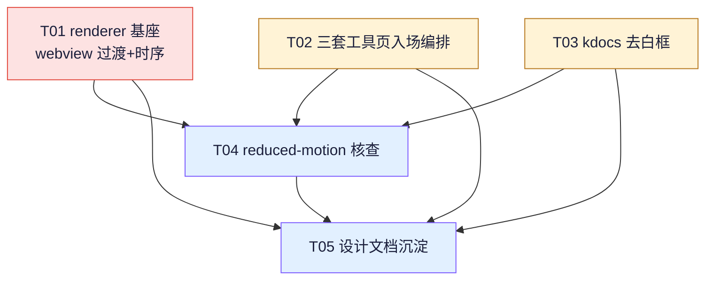

# tools-hub 系统架构设计 + 任务分解

> 架构师：高见远（Bob）｜基于主理人已确认诊断（P01 / P02 根因1+2）产出
> 项目路径：`E:/d/work/tools-hub`｜Electron 主进程 + 入口页 renderer 经 `<webview>` 内嵌 3 个独立 Express 前端

---

## Part A：系统设计方案

### 1. 实现方案 + 框架选型

**框架选型：沿用现有技术栈，零新增依赖、零构建步骤。**

- 渲染层：原生 HTML/CSS/JS（入口页 `renderer/`）。
- 嵌入方式：Electron `<webview>`（每个工具一个独立 webview 实例，`src` 指向本地 Express 端口：kdocs `:3599`、netdisk `:3000`、biliup `:3600`）。
- 三套工具前端（`kdocs-tool` / `netdisk-hub` / `biliup-hub`）均为独立 Express 服务，已各自**内联** `tokens.css` + `macos-motion.css` + `status-luxe.css` 副本（v0.1.43 起为修复打包后 `app.asar` 404 而内联，单一真源仍是 `shared/`），运行时零外部依赖。
- 主题同步：渲染进程 `window.electronAPI.setTheme` 上报主进程 → `webview-preload.js` 注入 `<html data-theme>` 并隐藏 `#themeBtn`；渲染进程经 `wv.send("sync-theme", t)` 把主题推给已开 webview。

**如何把"页面级入场"接上三套独立前端（根因2）：**

三套工具页 `index.html` 已内联完整 `macos-motion.css`（含 `.pop-in` 类与 `@keyframes popIn`），但**没有任何元素挂 `class="pop-in"`**，故首屏只"啪"地出现。修复采用**零侵入**方式：在各工具 `app.js` 运行时（脚本位于 `<body>` 末尾，等价于 DOMContentLoaded），按文档顺序给首屏可见块（`.wrap > header` / `.panel` / `.cards`）依次挂 `pop-in` + `--i`，直接复用既有 keyframes 做 stagger 弹入。**不改 HTML 结构、不改现有 class、不新增 CSS。**

**黑闪根因1 修复：**

`renderer/style.css` 的 `.wv` / `.wv.active` 当前只切 `visibility:hidden/visible`，无 opacity/transform 过渡 → 切工具页是"瞬切"；首次导航远程 HTML 有延迟，期间露出 `.wv` 自身深蓝背景 `background: var(--bg-2)`（≈黑）。两步解决：
1. 给 `.wv`/`.wv.active` 增加 `opacity(0→1)` + `transform(scale .98→1)` 过渡（淡入微缩放），保留 `visibility` 切换（避免 `display:none` 导致 webview 内部尺寸异常），隐藏侧把 `visibility:hidden` 延后到过渡结束。
2. 在 `renderer/app.js` 中**把"首次激活"延迟到 webview `dom-ready`**（内容就绪才淡入）；`dom-ready` 之前 webview 保持 hidden，下方带环境光渐变的 landing 仍可见 → 黑闪消失。已 loaded 的 webview 切回时直接激活（内容已在，淡入无黑）。

---

### 2. 文件列表（标注改动）

| 文件（相对仓库根） | 是否改动 | 改动内容 |
|---|---|---|
| `renderer/style.css` | ✅ 改 | `.wv`/`.wv.active` 增加 opacity+transform 过渡；确认 `prefers-reduced-motion` 降级（已被 `macos-motion.css` 的 `*` 规则覆盖，核查即可）。保持 `visibility` 切换语义 |
| `renderer/app.js` | ✅ 改 | `switchTab` 增加"未 `dom-ready` 不激活 / `data-pending`"逻辑；`dom-ready` 监听里激活 pending webview 并 `resize`；可选加 1500ms 兜底强制激活 |
| `kdocs-tool/public/app.js` | ✅ 改 | 顶部新增 `applyEntrance()`；脚本末尾对 `.wrap` 首屏可见块挂 `pop-in`+`--i` |
| `biliup-hub/public/app.js` | ✅ 改 | 同上（首屏 = header + 三个 `section.panel`） |
| `netdisk-hub/public/app.js` | ✅ 改 | 同上（首屏 = header + `.cards` + 三个 `.panel`，跳过隐藏的 `#banner`） |
| `kdocs-tool/public/index.html` | ✅ 改 | 在现有覆盖 `<style>` 内追加 `.status-row .chip .st-luxe` 去白框 + 颜色重指（P01） |
| `shared/macos-motion.css` | ❌ 不改 | 复用 `.pop-in` / `@keyframes popIn` / `--ease-*` / `--dur`，**不新增不修改** |
| `shared/status-luxe/*` | ❌ 不改 | P01 仅做 kdocs 局部 CSS 覆盖；全局 `data-theme` 修复见"待明确事项#3" |
| `docs/system_design.md` | ➕ 产出 | 本设计文档 |
| `docs/sequence-diagram.mermaid` | ➕ 产出 | 时序图 |
| `docs/class-diagram.mermaid` | ➕ 产出 | 类图 |

---

### 3. 关键数据结构 / 接口

**3.1 webview 显隐状态（renderer 侧，驱动过渡的 DOM 钩子）**

| 钩子 | 取值 | 含义 |
|---|---|---|
| `.wv` 类 | 常驻 | hidden 态：`visibility:hidden; opacity:0; transform:scale(.98)` |
| `.wv.active` 类 | 切换 | 显示态：`visibility:visible; opacity:1; transform:scale(1)`（CSS 过渡触发淡入微缩放） |
| `wv.dataset.ready` | `"1"` | `dom-ready` 已触发，内容就绪 |
| `wv.dataset.pending` | `"1"` | 已请求激活但内容未就绪，等待 `dom-ready` 再挂 `.active` |
| `wv.dataset.key` | 工具 key | `kdocs` / `netdisk` / `biliup` |

**3.2 入场编排 DOM 钩子（各工具 app.js，零侵入）**

```js
// 通用 helper（三套 app.js 各内联一份，约 15 行，不引文件、不碰 HTML）
function applyEntrance(scope, max) {
  try {
    if (window.matchMedia && window.matchMedia('(prefers-reduced-motion: reduce)').matches) return;
  } catch (e) {}
  const root = scope || document;
  const blocks = Array.from(root.children).filter((el) => {
    if (!el || !el.style) return false;
    const cs = getComputedStyle(el);
    if (cs.display === 'none' || cs.visibility === 'hidden') return false;
    if (el.offsetParent === null) return false;   // 不在渲染树（如隐藏面板）跳过
    return true;
  });
  const n = Math.min(max || 6, blocks.length);
  for (let i = 0; i < n; i++) {
    blocks[i].classList.add('pop-in');            // 复用 macos-motion.css 既有类
    blocks[i].style.setProperty('--i', i);         // stagger 序号（步长由 .pop-in 的 0.08s 决定）
  }
}
// 调用（脚本位于 body 末尾，DOM 已就绪）：
applyEntrance(document.querySelector('.wrap'));
```

**3.3 主题同步 IPC**

```
渲染进程 window.electronAPI.setTheme(t)  → 主进程
主进程 → webview-preload.js 注入 <html data-theme="t">，隐藏 #themeBtn
渲染进程 switchTab/syncThemeToWebviews → wv.send("sync-theme", t)  →  webview 内 document
```

---

### 4. 程序调用流程（时序图）

见 `docs/sequence-diagram.mermaid`（已导出）。要点：

```
点击卡片 → openTab 创建 <webview>
  → switchTab：未 dom-ready 则 data-pending=1（保持 hidden，下方 landing 可见，无黑闪）
  → webview 加载 → dom-ready：wv.send("sync-theme") + 挂 .active（CSS 淡入微缩放）+ resize
  → 工具页 app.js 末：applyEntrance() 给首屏块挂 pop-in+--i → stagger 弹入
```

---

### 5. 待明确事项（见 Part B §8）

---

## Part B：任务分解

> ⚠️ **任务粒度说明**：主理人诊断建议拆 T1–T7（7 项）。本设计按架构师角色硬性约束**整合为 ≤5 个顶层任务**（T01–T05），每个顶层任务内部保留对诊断 T1–T7 的映射，避免把无关模块硬合并、也避免单文件任务过度碎片化。其中 T01（renderer 双文件）、T03（kdocs 单文件）为精准修复，主动放宽"每任务 ≥3 文件"的软约束。

### 6. 依赖包列表

**无新增依赖。**

- 前端：原生 HTML/CSS/JS（无框架、无打包）。
- 动画：`shared/macos-motion.css`、各工具已内联的 `macos-motion.css` 副本（复用 `.pop-in`/`popIn`，不新增）。
- 状态：`shared/status-luxe/*` 及各工具副本（P01 仅局部覆盖，不改）。
- `package.json` / `package-lock.json` **无需改动**。

---

### 7. 任务列表（有序、含依赖）

| Task ID | 任务名 | 对应诊断 | Source Files | Dependencies | Priority |
|---|---|---|---|---|---|
| **T01** | renderer 基座：webview 显隐过渡 + 时序衔接（解决黑闪根因1） | T1 + T2 | `renderer/style.css`、`renderer/app.js` | 无 | P0 |
| **T02** | 三套工具页首屏入场编排（解决根因2 / 工具页无入场） | T3 + T4 + T5 | `kdocs-tool/public/app.js`、`biliup-hub/public/app.js`、`netdisk-hub/public/app.js` | 无（与 T01 可并行；建议 T01 先定基调） | P1 |
| **T03** | kdocs 状态标签去白框 | T6 | `kdocs-tool/public/index.html` | 无 | P1 |
| **T04** | reduced-motion 一致性核查与收口 | T7 | `renderer/style.css`、`kdocs-tool/public/index.html`、`biliup-hub/public/index.html`、`netdisk-hub/public/index.html`、`kdocs-tool/public/app.js`、`biliup-hub/public/app.js`、`netdisk-hub/public/app.js` | T01、T02、T03 | P2 |
| **T05** | 设计文档与交付物沉淀 | — | `docs/system_design.md`、`docs/sequence-diagram.mermaid`、`docs/class-diagram.mermaid` | 全部（随实现增量更新） | P2 |

**各任务实现要点：**

- **T01（黑闪根因1）**
  - `style.css`：`.wv` 增加 `opacity:0; transform:scale(.98)` 与 `transition: opacity var(--dur) var(--ease-out), transform var(--dur) var(--ease-spring), visibility 0s linear var(--dur)`；`.wv.active` 设 `opacity:1; transform:scale(1)` 且 `transition` 中 `visibility 0s linear 0s`（显示立即 visible、再淡入）。`background: var(--bg-2)` 保留。
  - `app.js`：`switchTab` 激活分支——若 `!wv.dataset.ready` 则置 `data-pending=1` 且不挂 `.active`；`dom-ready` 监听里若 `data-pending` 则挂 `.active` 并 `resize`；已 ready 直接挂 `.active`。可选：创建 webview 时设 1500ms 兜底强制激活（防服务未起导致永不显示）。
- **T02（工具页入场）**：三套 `app.js` 各内联 `applyEntrance()`（见 §3.2），脚本末尾对 `.wrap` 首屏可见块挂 `pop-in`+`--i`。kdocs 取 header/`.status-row`/首个可见 `.panel`；biliup 取 header + 三个 `section.panel`；netdisk 取 header/`.cards`/三个 `.panel`（跳过 `display:none` 的 `#banner`）。
- **T03（P01 去白框）**：见 §8 的精确选择器与 CSS。
- **T04（reduced-motion）**：逐项核查 (1) renderer `.wv`/`.landing` 过渡被 `macos-motion.css` 的 `@media (prefers-reduced-motion)` `*` 规则降级；(2) 三套工具页 `pop-in` 被各自内联 `macos-motion.css` 降级；(3) `status-luxe.css` 自带 reduced-motion 规则生效；(4) `applyEntrance` 的 `matchMedia` 守卫在命中时跳过挂 `pop-in`。统一行为：reduced-motion 时直接显示、无过渡/动画。
- **T05**：本交付物，随实现同步更新。

---

### 8. 共享知识（跨文件约定）

| 约定 | 取值 / 说明 |
|---|---|
| 入场 class 命名 | `pop-in`（已存在于 `macos-motion.css`，**复用，勿新增**） |
| `--i` 步长 | **实际 `macos-motion.css` 为 `calc(var(--i,0) * 0.08s)` = 80ms** ⚠️（与诊断描述的 60ms 不符，以实际文件为准，勿改共享文件） |
| 缓动 / 时长 token | `--ease-spring: cubic-bezier(0.34,1.56,0.64,1)`、`--ease-out: cubic-bezier(0.22,1,0.36,1)`、`--dur: 0.28s`（以 `shared/macos-motion.css` 实际值为准；⚠️ 诊断写的 `--ease-out` 为 `cubic-bezier(0.16,1,0.3,1)`，以实际为准） |
| reduced-motion | 由 `macos-motion.css` / `status-luxe.css` 的 `@media (prefers-reduced-motion: reduce)` 统一降级；`applyEntrance` 额外加 `matchMedia` 守卫 |
| 主题变量复用 | `var(--bg-2)`、`var(--ok)`、`var(--text)` 等 tokens 来自 `shared/tokens.css`（三套工具内联副本，单一真源）；主题由 `webview-preload` 注入 `data-theme` 并隐藏 `#themeBtn`，渲染进程经 `wv.send("sync-theme", t)` 同步；**勿硬编码颜色** |
| DOM id 不变 | 所有元素 id 保持现状（`landing` / `wv-<key>` / `chipKdocs` / `chipBl` / `verBadge` …），仅增 class / `data-*` 属性 |
| 入场 hook 零侵入 | 只在各 `app.js` 运行时给首屏块挂 `pop-in`+`--i`，**不改 HTML 结构、不改现有 class** |
| P01 状态色键控陷阱 | `status-luxe` 胶囊色 token（`--st-*`）键控 `prefers-color-scheme`，但工具主题由 `data-theme` 管理（两者解耦）。P01 修复把状态色重指向页面 `--ok`/`--text` 等，避免明暗错配（详见待明确事项#3） |

**P01 精确修复（T03，kdocs `index.html` 覆盖 `<style>` 内追加）：**

```css
/* P01：状态胶囊去白框 → 轻量文字 + 点，明暗主题都干净 */
.status-row .chip .st-luxe {
  background: transparent;
  border-color: transparent;
  box-shadow: none;
  backdrop-filter: none;
  -webkit-backdrop-filter: none;
  padding-left: 2px;
}
/* 颜色重指到页面主题 token（规避 status-luxe 键控 prefers-color-scheme 的明暗错配） */
.status-row .chip .st-luxe--ok   { --c: var(--ok);        --txt: var(--text); }
.status-row .chip .st-luxe--off  { --c: var(--text-dim);  --txt: var(--text-dim); }
.status-row .chip .st-luxe--warn { --c: var(--warn);      --txt: var(--text); }
.status-row .chip .st-luxe--err  { --c: var(--err);       --txt: var(--text); }
.status-row .chip .st-luxe--info { --c: var(--accent-2);  --txt: var(--text); }
```
> 实现时核对选择器：当前 `kdocs` `initCheck()` 已用 `statusHTML()` 渲染 `.st-luxe` 胶囊（非诊断旧描述的 `.chip` 纯文本），白框即该胶囊玻璃背景 `var(--bg)` 在亮色主题下读感发白。若线上仍为无 `.st-luxe` 的旧结构，则改为对 `.chip` / 其文本节点去白框。

---

### 9. 待明确事项

1. **`macos-motion.css` 实际值与诊断描述不一致**：诊断写 `--i` 步长 60ms、`--ease-out: cubic-bezier(0.16,1,0.3,1)`；但 `shared/macos-motion.css` 及三套工具内联副本实际为 **80ms** 与 `cubic-bezier(0.22,1,0.36,1)`。设计以实际文件为准（不修改共享文件）。若主理人确需 60ms，需同步改 `shared/macos-motion.css` 及三处内联副本（超出"复用不新增"范围，须单独确认）。
2. **P01 选择器需实现时核对**：见 §8 P01 说明——当前为 `.st-luxe` 胶囊，白框源自其玻璃背景；建议以浏览器实际 DOM 为准落选择器。
3. **`status-luxe` 颜色键控 `prefers-color-scheme` 与工具 `data-theme` 解耦（潜在更深根因）**：这是明暗主题下状态色可能错配的源头。P01 仅做 kdocs 局部覆盖；建议另立任务统一把 `shared/status-luxe.css` 改为 `[data-theme="dark"|"light"]` 选择器（覆盖三套工具 + 入口页），不在本次 P01 范围。
4. **netdisk `.cards` 异步填充**：账号卡片由 `loadAccounts()` 异步渲染，`pop-in` 在 `applyEntrance` 时挂到空容器上、内容随后填入——视觉可接受；若要求卡片内容也 stagger，需在 `loadAccounts()` 渲染后补挂（超出零侵入范围，建议保持容器级）。
5. **黑闪兜底超时**：T01 把"首次激活"延迟到 `dom-ready`，若服务未起 / `dom-ready` 不触发，webview 永不显示。建议加 ~1500ms 兜底强制激活（实现时确认是否纳入）。

---

### 10. 任务依赖图



---

## Part C：设计如何同时解决"黑闪"与"工具页无入场"

**黑闪（根因1）** —— 双保险：
1. **过渡层**：`.wv` 由纯 `visibility` 切换改为 `opacity 0→1 + transform scale .98→1` 过渡。切换瞬间不再是"硬切"，而是 webview 容器平滑淡入并微缩放，即使内容略有延迟，用户看到的是 webview 在 landing（带环境光渐变，非纯黑）之上渐显，黑感被柔化。
2. **时序层（关键）**：把"首次激活"延迟到 webview `dom-ready`——在远程 HTML 未就绪前 webview 保持 hidden，下方 landing 一直可见；内容就绪（`dom-ready`）那一刻才挂 `.active` 淡入，此时展示的已是加载好的页面壳，深蓝背景根本不会被用户看到。已 loaded 的 webview 切回直接淡入（内容已在）。两者叠加 → 黑闪消除。

**工具页无入场（根因2）** —— 零侵入复用既有动效资产：
三套工具页早已内联完整 `macos-motion.css`（含 `.pop-in` 类与 `@keyframes popIn`），缺的只是"打开页面那一刻的入场编排"。`applyEntrance()` 在每套 `app.js` 运行时按文档顺序给首屏可见块（header / `.panel` / `.cards`）挂 `pop-in` + `--i`，直接驱动既有 stagger 弹入。按钮 hover/点击的弹簧缓动本来就有（`.btn/.panel` 的 `--ease-spring` 过渡），现在补上"页面级入场"这一环，与入口页卡片的 `pop-in` stagger 体验对齐。

**统一护栏**：两套修复都复用现有 `prefers-reduced-motion` 降级（`macos-motion.css` 的 `*` 规则 + `status-luxe.css` 自带规则 + `applyEntrance` 的 `matchMedia` 守卫），并在明暗主题下自动适配（全部走 `var(--bg-2)`/`var(--ok)`/`var(--text)` 等 token，DOM id 保持不变）。
